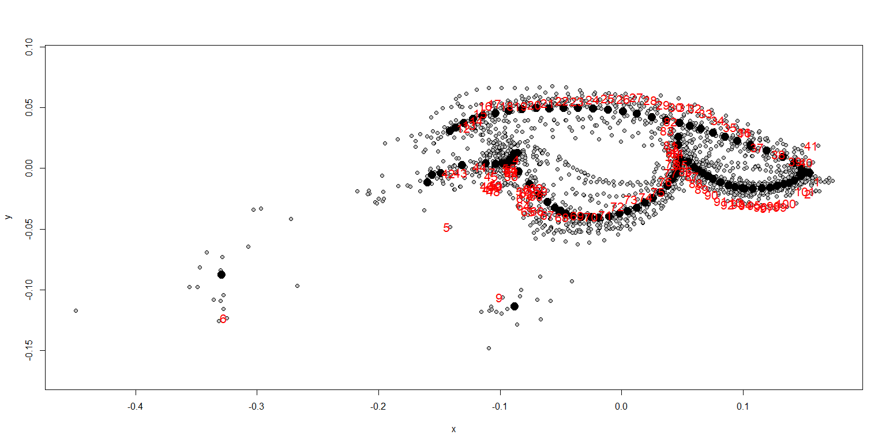
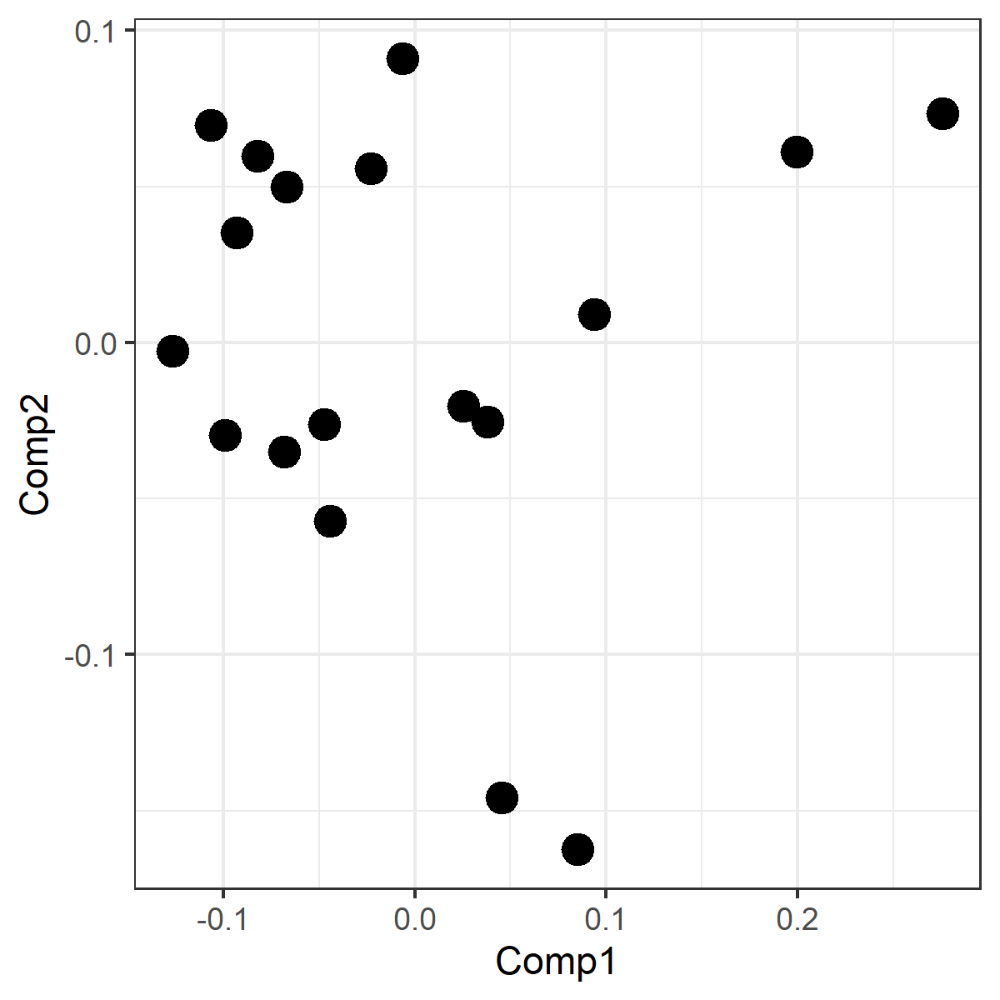
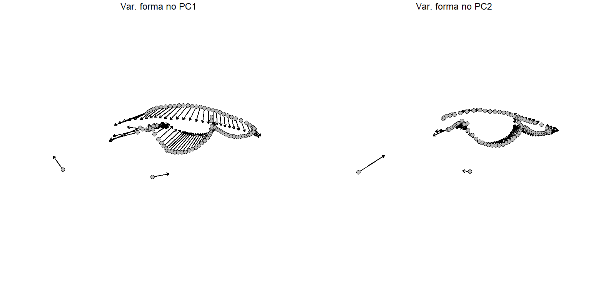
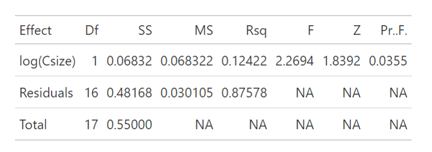
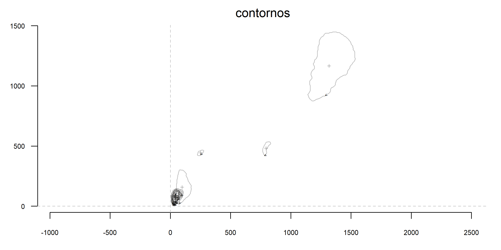
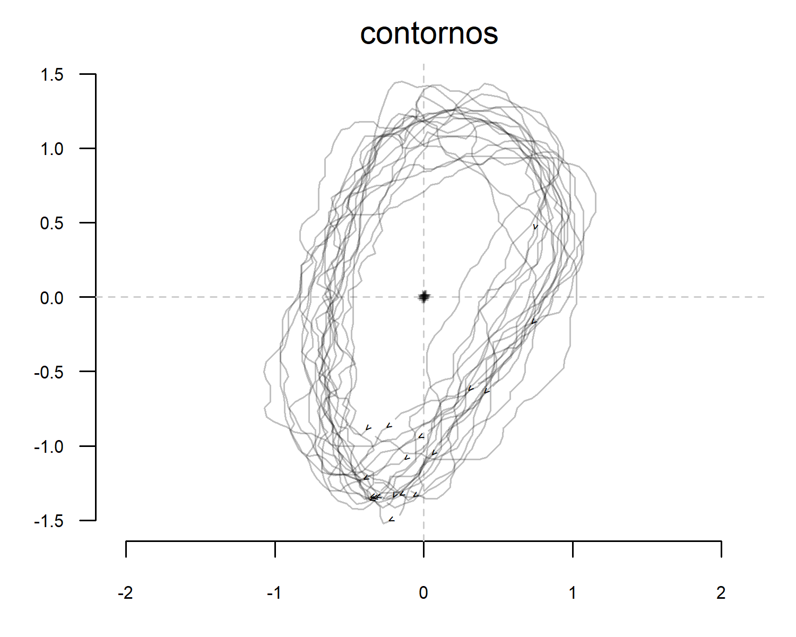
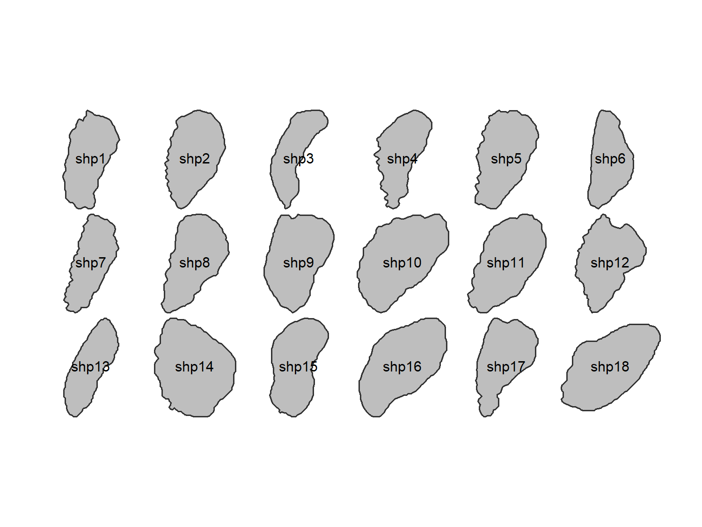
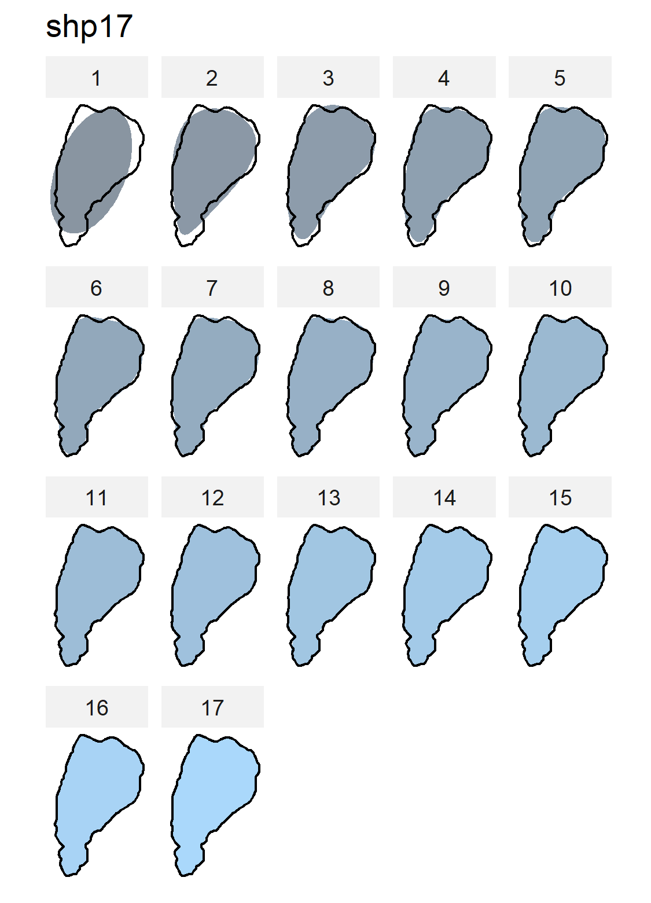
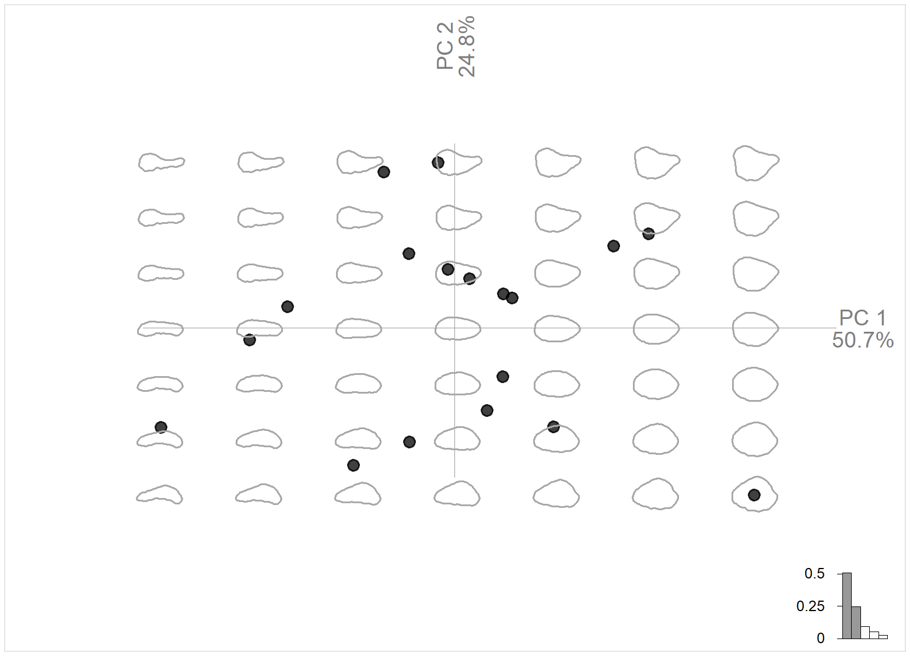

# Curvas e contornos
Já foram publicados diferentes sistemas de classificação para os landmarks que utilizamos na morfometria geométrica. O sistema mais amplamente difundido foi definido por Bookstein (1991), e nele os marcos anatômicos são classificados em tipos de I a III de acordo com o quanto são capazes de definir pontos anatômicos fixos e bem definidos. Os landmarks de menor precisão anatômica (os do *tipo III*), por exemplo, costumam ser definidos pela geometria da estrutura, embora não necessariamente representem uma característica anatômica distinta.  
Landmarks do tipo III costumam ser empregados em situações nas quais a descrição da forma se torna difícil. Imagine uma crista óssea, por exemplo. O ponto em que ela se inicia e o ponto em que ela se encerra são de fácil identificação; mas caracterizar a variação da sua altura ou curvatura não é trivial. Embora posicionar um landmark adicional na metade da curvatura pareça uma boa saída, pode não ser o suficiente.    

## 1. Semilandmarks
Casos como este mostram que às vezes uma estrutura é melhor descrita por curvas do que através do posicionamento de pontos isolados. Nestes casos, é a forma da estrutura como um todo que é tomada como homóloga dentro da amostra. Assim definimos os chamados **semilandmarks**, como vimos durante a [aula 5](Aula%205.pdf). Na prática, a ideia é inserir diversos pontos para desenhar uma curva ao longo de um trecho de interesse e realizar um processo de reamostragem visando uniformizar a quantidade de pontos utilizada.  
Fizemos isso em sala de aula. Geramos um conjunto de dados para 18 espécies de sapos do gênero *Rhinella*, que pode ser baixado [aqui](Rhinella.TPS). As imagens foram retiradas da literatura ([Caramaschi & Pombal Jr., 2006](https://doi.org/10.1590/S0031-10492006002300001); [Maciel et al., 2007](https://doi.org/10.11646/zootaxa.1627.1.2); [Maciel, 2008](https://www.researchgate.net/publication/47353552_Sistematica_e_biogeografia_do_grupo_Rhinella_marina_Linnaeus_1758_Anura_Bufonidae); [Narvaes & Rodrigues, 2009](https://doi.org/10.11606/issn.2176-7793.v40i1p1-73); [Vaz-Silva et al., 2015](https://doi.org/10.1655/HERPETOLOGICA-D-14-00039); [Rebouças et al., 2019](https://doi.org/10.2994/SAJH-D-17-00031.1); [Lehr et al., 2021](https://doi.org/10.3390/taxonomy1030015)), e utilizamos a conformação de landmarks proposta por [Bandeira et al., 2016](https://doi.org/10.1111/zoj.12460), com algumas alterações apresentadas nos últimos slides da [aula 5](Aula%205.pdf). Aqui a idéia é utilizar semilandmarks para caracterizar a forma das cristas cefálicas presentes em *Rhinella*, gerando uma forma pra cabeça. Se quiserem treinar o posicionamento de landmarls no `TpsDig` podem fazer o download das figuras [aqui](Fotos_Aula5.zip).

```{r data}
# Definir o diretório de trabalho
setwd("C:/caminho/para/pasta/desejada")

# Carregar pacotes necessários
library(geomorph)
library(tidyverse)
library(Momocs)

# Carregar os dados
land.dt<-readland.tps("Rhinella.TPS", specID = "imageID", readcurves = TRUE)

# Verificando o número de dimensões do nosso tps
dim(land.dt)
```

Repare que `readcurves = TRUE` é usado para informar o `R` que os semilandmarks (que são apresentados como *curves* no `.tps`, podem abrir o arquivo no bloco de notas para confirmar) devem ser lidos. Outra informação importante é que o resultado para a função `dim()` é `[1] 101   2  18` O terceiro valor (`18`) se refere ao número de indivíduos no `Rhinella.TPS`; o segundo, representa o número de dimensões da amostragem (`2`, o que significa que os landmarks foram posicionados em material `2D`); já o primeiro valor (`101`) indica o número de *landmarks* lido pelo `R`. Em outras palavras, **todos** os pontos posicionados (sejam eles *landmarks* ou *semilandmarks*) são lidos da mesma maneira até aqui.  
Veja que isso gera um impasse do ponto de vista da análise. Sabemos que *semilandmarks* são menos precisos na descrição da forma, já que *um único semilandmark* isolado *não descreve nenhuma estrutura anatômica por si só*. Por outro lado, *são necessários muitos pontos para descrever uma única curva*, o que os transforma em *maioria* dentro do `.tps` (veja que aqui temos 11 landmarks e 90 semilandmarks). Na prática, exercem um papel estatisticamente muito relevante.  
Consequentemente, precisamos de alguma metodologia que permita *reduzir o peso dado aos semilandmarks na análise*. Isso é feito usando um processo chamado **deslizamento**, ou **sliding**. A ideia é de certo modo minimizar a distorção constatada localmente, nas regiões descritas por semilandmarks. Isso é feito em função da grade `tps` nessa região (a chamada minimização de *bending energy*), ou através de uma análise de Procrustes (`GPA`) usando as curvas separadamente. Para realizar o *sliding*, definimos quais as curvas no nosso conjunto de dados: 

```{r curvas}
# Defina os sliders para cada curva
c1 <- define.sliders(11:42)
c2 <- define.sliders(41:52)
c3 <- define.sliders(51:82)
c4 <- define.sliders(81:101)
```

Vale ressaltar que a função `define.sliders()` é aplicada indicando *entre quais pontos do tps estão os semilandmarks de uma determinada curva*. Pensando no nosso exemplo: se temos 11 landmarks, o ponto nº 12 será o primeiro semilandmark da primeira curva; se essa curva à qual ele pertence é formada por 30 semilandmarks, entao o último semilandmark que a compõe será o `12 + 29 = 41`; sendo assim, a curva 1 (`c1`) está limitada **entre** os pontos **11** e **42**.  
Uma vez destacados quem são os semilandmarks e suas respectivas curvas, podemos indicá-los durante nossa `GPA`:

```{r gpa}
# Ajuste usando gpagen
gpa <- gpagen(land.dt, curves = rbind(c1, c2, c3, c4), 
              ProcD = FALSE)

# Visualizemos os landmarks alinhados e suas respectivas identificações
plotAllSpecimens(gpa$coords)
text(gpa$coords[, , 1], labels = 1:nrow(gpa$coords), 
     col = "red", cex = 0.8) # Ajuste `cex` conforme necessário
```

<p align="center">

</p>

A partir daí, podemos seguir normalmente com as análises, porque os dados já se encontram em um mesmo espaço da forma. 

```{r pca}
# Ajuste usando gpagen
pca <- gm.prcomp(gpa$coords)

# Gerando um dataframe
df.pca <- pca$x[,1:3]

# Plotando o morfoespaço
ggplot(df.pca, aes(x=Comp1, y=Comp2))+
  geom_point(size=4)+
  theme_bw()
```

<p align="center">

</p>

Se rodarmos `summary(pca)`, veremos que os dois primeiros eixos da `PCA` explicam 53% da variação da forma. Também podemos visualizar as grades de deformação ao longo dos extremos do morfoespaço, em função do PC1...  
```{r grade}
plotRefToTarget(M1 = pca$shapes$shapes.comp1$min, 
                M2 = pca$shapes$shapes.comp1$max, 
                mag=1, method = "vector", useRefPts = F)

plotRefToTarget(M1 = pca$shapes$shapes.comp2$min, 
                M2 = pca$shapes$shapes.comp2$max, 
                mag=1, method = "vector", useRefPts = F)
```

<p align="center">

</p>

Do mesmo modo, também podemos testar alometria e outros efeitos, como demonstrado nas aulas passadas  

```{r alometria}
#Podemos testar o que quisermos agora. Como a alometria
m1<-procD.lm(coords ~ log(Csize), data=gpa, size = gpa$Csize, iter = 9999)
summary(m1)
```
<p align="center">

</p>

Obviamente, os resultados da alometria podem ser melhor explorados (utilizando gráficos, grades de distorção, etc). Não vamos nos aprofundar para não ficar repetitivo, mas vocês podem acessar mais detalhes e scripts no material das [aulas 3 e 4](intrmorfgeom.md).  


## 2. Transformada Elíptica de Fourier
Se por um lado podemos aumentar a distribuição de pontos usando *semilandmarks* para descrever melhor a morfologia, existe uma outra metodologia que visa caracterizar a forma sem a utilização de quaisquer marcos de referência. Trata-se da aplicação de transformadas elípticas de Fourier, técnica matemática usada para descrever e quantificar *a forma de contornos bidimensionais fechados de objetos*. Dessa maneira, está obrigatoriamente limitada ao `2D` e não pode ser aplicada a qualquer estrutura, mas ainda assim representa uma ferramenta poderosa para análises morfológicas. Aqui vamos utilizá-la para analisar a forma das glândulas parotoides. São grandes glândulas localizadas dorsalmente, posterolaterais à cabeça, e que produzem uma secreção que atua como mecanismo de defesa para o grupo. A forma dessas glândulas varia bastante entre espécies, de modo que é uma característica importante para o gênero *Rhinella* do ponto de vista taxonômico.  
A análise de Fourier é aplicada para identificar os contornos diretamente, de modo que precisam ser *muito* evidentes. Por esse motivo, é necessário realizar alguns tratamentos prévios nas imagens. O principal deles é transformar cada figura em binária, destacando nossa região de interesse em preto contra um fundo branco e salvando a imagem em escala de cinza. Você pode fazer isso em diversos programas de edição de imagens (particularmente, eu costumo usar o [GIMP](https://www.gimp.org/) por ser gratuito e intuitivo). Além disso, como não existe um sistema de referência de coordenadas associado, efeitos como o tamanho são um tema delicado na transformada de Fourier. Por isso, no tratamento prévio também é interessante corrigir as imagens originais para que todas mantenham uma mesma escala. As figuras já tratadas podem ser baixadas [aqui](Fourier_Aula5.zip). Salve essas figuras em uma subpasta a parte.  

```{r dados_TF}
# Indique onde está a pasta com as figuras
caminho <- "C:/Users/Caminho/Para/A/Pasta/Das/Imagens/Tratadas/"

# Agora é possível ler todas de uma única vez
imgs <- list.files(path = caminho, pattern = "\\.jpg$", full.names = TRUE)

```

Uma vez que existe um objeto listando onde estão todas as imagens, vamos ler todas de uma única vez aplicando a função `import_jpg()`. As imagens importadas estarão salvas em um objeto do tipo `lista`, que costuma ser bastante complexo por aceitar objetos de natureza distinta em níveis e subníveis distintos. Para que os dados estejam no formato adequado para o pacote, precisamos extraí-los para um subnível mais acessível. Por isso, exercemos essa extração a cada indivíduo `x[[1]]`.

```{r contornos}
# Extrair os contornos das imagens com os ids
contornos <- lapply(imgs, import_jpg)

# Adequar a estrutura do objeto para que seja acessível às funções do pacote Momocs
contornos <- lapply(contornos, function(x) x[[1]])

# Transformando os contornos para a classe utilizada pelo pacote
contornos <- Out(contornos)
```

Agora podemos visualizar as formas que extraímos usando a função `stack()`. Aqui os "eixos" apresentados mostram a posição de cada forma no `.jpg` lido.  
```{r stack}
stack(contornos)
```
<p align="center">

</p>

Repare que os contornos podem estar plotados em qualquer lugar nessa figura, e isso acaba se tornando um problema na nossa análise porque a abordagem por Fourier não possui uma `GPA`. Mais adiante vou demonstrar que até existe um processo de normalização que é tido como *análogo*, mas que acaba sendo problemático em um aspecto importante do nosso conjunto de dados. Sendo assim, precisamos nos certificar de que os dados serão centralizados para que sejam comparáveis. E isso é só o início. Também é importante ajustarmos a escala dos dados e a *quantidade de pontos de amostragem*. Acontece que a abordagem matemática por Fourier é baseada no conceito de **harmônicos**. É como se a análise partisse de uma forma elíptica simples que vai sendo moldada no formato dos contornos dos nossos objetos de estudo. Além disso, é como se esse processo de *modelagem* fosse realizado percorrendo seguidamente voltas ao longo dessa forma elíptica original. A quantidade de vezes que esse *percurso* é repetido é o nosso *número de harmônicos*. Já a quantidade de vezes em que é "checada" a diferença entre essa forma elíptica original e nossa forma de interesse é dada pelo número de pontos que descrevem nossa estrutura de interesse. Aqui no nosso caso, glândulas maiores precisam de mais pontos para terem seu contorno desenhado, o que significa que a caracterização de glândulas menores poderia atingir um bom nível mais rápido. Para evitar essa discrepância, vamos definir um número de pontos que queremos atribuir às glândulas de todos os 18 sapos. Após isso, o processo de centralização, correção de escala e do número de pontos (aumentando ou diminuindo) será automatiado através de um loop:   

```{r loop_TF}
# Defina o número desejado de pontos
n.pts <- 500

# Reamostrar contornos para o número desejado de pontos usando interpolação
reamostragem <- lapply(contornos$coo, function(x) {
  # Centralizar o contorno
  x <- coo_center(x)
  
  # Escalar o contorno para remover o efeito do tamanho
  x <- coo_scale(x)
  
  # Verifique se o contorno tem menos pontos do que o desejado
  if (nrow(x) < n.pts) {
    # Use coo_interpolate para aumentar o número de pontos
    coo_interpolate(x, n = n.pts)
  } else {
    # Use coo_sample se já tiver mais pontos que o necessário
    coo_sample(x, n = n.pts)
  }
})

# Guardamos esses contornos corrigidos no nosso objeto original
contornos$coo <- reamostragem
```

Se repetirmos o `stack()` agora, veremos que os dados parecem muito mais comparáveis.  
```{r stack2}
stack(contornos)
```
<p align="center">

</p>

Também podemos observar quais são todas as formas de glândulas que estão presentes em nossa amostra  
```{r painel}
panel(contornos, col="gray")
```
<p align="center">

</p>

A partir de agora, podemos buscar o número ideal de harmônicos necessário para representar a forma das glândulas de *Rhinella*. 
```{r numharmonicos}
# Definindo os harmônicos. O número máximo é dado pelo nº pontos/2
hpow <- calibrate_harmonicpower_efourier(contornos, nb.h=n.pts/2)
print(hpow$minh)
```

Com isso, vemos que 99% da forma já é bem definida usando 17 harmônicos na nossa amostra. Podemos, inclusive, observar como o aumento no número de harmônicos vai se ajustando aos contornos de uma determinada forma. Para isso, vamos ver o impacto de todos os harmônicos utilizados sobre os contornos da espécie nº 17:
```{r calibragem}
# Vendo o ajuste dos harmônicos a um indivíduo específico
calibrate_reconstructions_efourier(contornos, id = 17, range = 1:17)
```
<p align="center">

</p>

Por fim, aplicamos a análise de Fourier aos contornos. Repare que o argumento `norm = T` se refere ao processo de normalização dos dados que citei acima. Nele, é esperada uma espécie de correção por escala, orientação e posição do conjunto de dados. O problema é que esse tipo de correção numa `GPA` é feita levando-se em consideração um sistema de referência: as posições relativas dos landmarks na morfometria geométrica permitem que a análise rotacione o conjunto de dados sem perda do significado biológico. Imagine que temos 4 landmarks indicando o ponto mais anterior, o mais posterior e os dois pontos que definem o eixo de maior largura na glândula dos sapos do nosso dataset. Se respeitamos o posicionamento de landmarks mantendo a mesma ordem, então a `GPA` vai alinhar todas as glândulas em um mesmo sentido porque os landmarks vão atuar como um *sistema de referência*. O problema é que isso não existe na análise de Fourier. Até existe a possibilidade de aplicar as duas técnicas (morfometria geométrica e transformada elíptica de Fourier) sobre o mesmo conjunto de dados, utilizando landmarks para alinhar as formas que serão transformadas por Fourier, mas não estamos usando essa abordagem (para ver um exemplo, consulte [essa página](https://rfrelat.github.io/FishMorpho.html)). Sendo assim, se houver um sapo que possui a região anterior mais larga que a posterior, e outro em que ocorre o contrário, a rotação vai sobrepor regiões que não são comparáveis. Talvez estruturas mais complexas permitam esse tipo de normalização direta, mas preferi aplicar um pré-tratamento nos dados com o loop que apresentei anteriormente. Com isso, já temos uma orientação prévia condizente com o significado biológico, e atribuir a normalização dos dados agora passa a ser uma espécie de *ajuste fino*. Por isso, mantemos `norm = T`.    

```{r calibragem}
# Análise elíptica de Fourier
rhinel_efa <- efourier(contornos, norm = T, nb.h = 17)
```
 
Para finalizar, podemos gerar uma `PCA` afim de obter uma representação do morfoespaço obtido:
```{r PCA_fourier}
# PCA
rhinel_pca <- PCA(rhinel_aef)

# Plotando o morfoespaço
PCA.fourier<-plot_PCA(rhinel_pca, morphospace = F, zoom = 1, center_origin = T)
plot_PCA(rhinel_pca, 
         layer_morphospace_PCA(PCA.fourier, nr=7, nc=7, col="darkgray", size = 0.7))
```
<p align="center">

</p>

 
