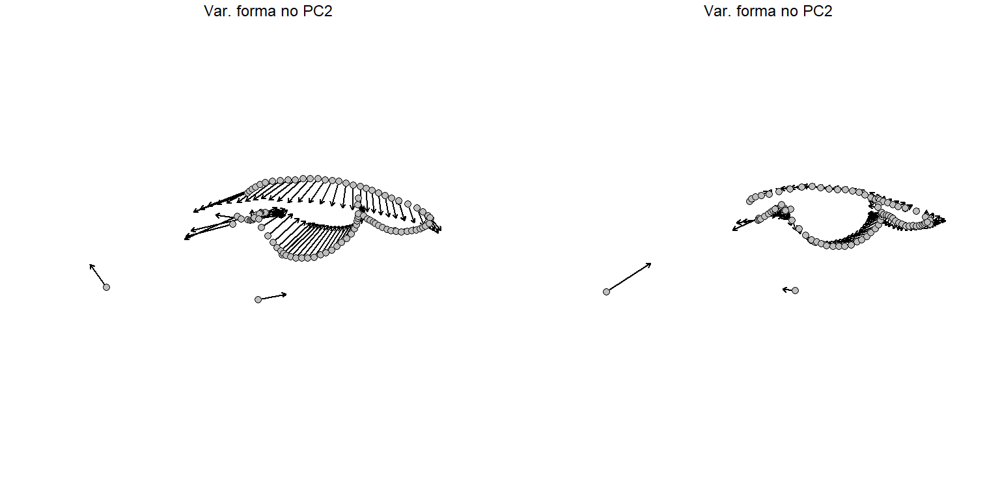

# Contornos
Já foram publicados diferentes sistemas de classificação para os landmarks que utilizamos na morfometria geométrica. O sistema mais amplamente difundido foi definido por Bookstein (1991), e nele os marcos anatômicos são classificados em tipos de I a III de acordo com o quanto são capazes de definir pontos anatômicos fixos e bem definidos. Os landmarks de menor precisão anatômica (os do *tipo III*), por exemplo, costumam ser definidos pela geometria da estrutura, embora não necessariamente representem uma característica anatômica distinta.  
Landmarks do tipo III costumam ser empregados em situações nas quais a descrição da forma se torna difícil. Imagine uma crista óssea, por exemplo. O ponto em que ela se inicia e o ponto em que ela se encerra são de fácil identificação; mas caracterizar a variação da sua altura ou curvatura não é trivial. Embora posicionar um landmark adicional na metade da curvatura pareça uma boa saída, pode não ser o suficiente.    

## 1. Semilandmarks
Casos como este mostram que às vezes uma estrutura é melhor descrita por curvas do que através do posicionamento de pontos isolados. Nestes casos, é a forma da estrutura como um todo que é tomada como homóloga dentro da amostra. Assim definimos os chamados **semilandmarks**, como vimos durante a [aula 5](Aula%205.pdf). Na prática, a ideia é inserir diversos pontos para desenhar uma curva ao longo de um trecho de interesse e realizar um processo de reamostragem visando uniformizar a quantidade de pontos utilizada.  
Fizemos isso em sala de aula. Geramos um conjunto de dados para 18 espécies de sapos do gênero *Rhinella*, que pode ser baixado [aqui](Rhinella.TPS). As imagens foram retiradas da literatura ([Caramaschi & Pombal Jr., 2006](https://doi.org/10.1590/S0031-10492006002300001); [Maciel et al., 2007](https://doi.org/10.11646/zootaxa.1627.1.2); [Maciel, 2008](https://www.researchgate.net/publication/47353552_Sistematica_e_biogeografia_do_grupo_Rhinella_marina_Linnaeus_1758_Anura_Bufonidae); [Narvaes & Rodrigues, 2009](https://doi.org/10.11606/issn.2176-7793.v40i1p1-73); [Vaz-Silva et al., 2015](https://doi.org/10.1655/HERPETOLOGICA-D-14-00039); [Rebouças et al., 2019](https://doi.org/10.2994/SAJH-D-17-00031.1); [Lehr et al., 2021](https://doi.org/10.3390/taxonomy1030015)), e utilizamos a conformação de landmarks proposta por [Bandeira et al., 2016](https://doi.org/10.1111/zoj.12460), com algumas alterações apresentadas nos últimos slides da [aula 5](Aula%205.pdf). Se quiserem treinar o posicionamento de landmarls no `TpsDig` podem fazer o download das figuras [aqui](Fotos_Aula5.zip).

```{r data}
# Definir o diretório de trabalho
setwd("C:/caminho/para/pasta/desejada")

# Carregar pacotes necessários
library(geomorph)
library(tidyverse)
library(Momocs)

# Carregar os dados
land.dt<-readland.tps("Rhinella.TPS", specID = "imageID", readcurves = TRUE)

# Verificando o número de dimensões do nosso tps
dim(land.dt)
```

Repare que `readcurves = TRUE` é usado para informar o `R` que os semilandmarks (que são apresentados como *curves* no `.tps`, podem abrir o arquivo no bloco de notas para confirmar) devem ser lidos. Outra informação importante é que o resultado para a função `dim()` é `[1] 101   2  18` O terceiro valor (`18`) se refere ao número de indivíduos no `Rhinella.TPS`; o segundo, representa o número de dimensões da amostragem (`2`, o que significa que os landmarks foram posicionados em material `2D`); já o primeiro valor (`101`) indica o número de *landmarks* lido pelo `R`. Em outras palavras, **todos** os pontos posicionados (sejam eles *landmarks* ou *semilandmarks*) são lidos da mesma maneira até aqui.  
Veja que isso gera um impasse do ponto de vista da análise. Sabemos que *semilandmarks* são menos precisos na descrição da forma, já que *um único semilandmark* isolado *não descreve nenhuma estrutura anatômica por si só*. Por outro lado, *são necessários muitos pontos para descrever uma única curva*, o que os transforma em *maioria* dentro do `.tps` (veja que aqui temos 11 landmarks e 90 semilandmarks). Na prática, exercem um papel estatisticamente muito relevante.  
Consequentemente, precisamos de alguma metodologia que permita *reduzir o peso dado aos semilandmarks na análise*. Isso é feito usando um processo chamado **deslizamento**, ou **sliding**. A ideia é de certo modo minimizar a distorção constatada localmente, nas regiões descritas por semilandmarks. Isso é feito em função da grade `tps` nessa região (a chamada minimização de *bending energy*), ou através de uma análise de Procrustes (`GPA`) usando as curvas separadamente. Para realizar o *sliding*, definimos quais as curvas no nosso conjunto de dados: 

```{r curvas}
# Defina os sliders para cada curva
c1 <- define.sliders(11:42)
c2 <- define.sliders(41:52)
c3 <- define.sliders(51:82)
c4 <- define.sliders(81:101)
```

Vale ressaltar que a função `define.sliders()` é aplicada indicando *entre quais pontos do tps estão os semilandmarks de uma determinada curva*. Pensando no nosso exemplo: se temos 11 landmarks, o ponto nº 12 será o primeiro semilandmark da primeira curva; se essa curva à qual ele pertence é formada por 30 semilandmarks, entao o último semilandmark que a compõe será o `12 + 29 = 41`; sendo assim, a curva 1 (`c1`) está limitada **entre** os pontos **11** e **42**.  
Uma vez destacados quem são os semilandmarks e suas respectivas curvas, podemos indicá-los durante nossa `GPA`:

```{r gpa}
# Ajuste usando gpagen
gpa <- gpagen(land.dt, curves = rbind(c1, c2, c3, c4), 
              ProcD = FALSE)

# Visualizemos os landmarks alinhados e suas respectivas identificações
plotAllSpecimens(gpa$coords)
text(gpa$coords[, , 1], labels = 1:nrow(gpa$coords), 
     col = "red", cex = 0.8) # Ajuste `cex` conforme necessário
```

<p align="center">

</p>

A partir daí, podemos seguir normalmente com as análises, porque os dados já se encontram em um mesmo espaço da forma. 

```{r pca}
# Ajuste usando gpagen
pca <- gm.prcomp(gpa$coords)

# Gerando um dataframe
df.pca <- pca$x[,1:3]

# Plotando o morfoespaço
ggplot(df.pca, aes(x=Comp1, y=Comp2))+
  geom_point(size=4)+
  theme_bw()
```

<p align="center">

</p>

Se rodarmos `summary(pca)`, veremos que os dois primeiros eixos da `PCA` explicam 53% da variação da forma. Também podemos visualizar as grades de deformação ao longo dos extremos do morfoespaço, em função do PC1...  
```{r grade}
plotRefToTarget(M1 = pca$shapes$shapes.comp1$min, 
                M2 = pca$shapes$shapes.comp1$max, 
                mag=1, method = "vector", useRefPts = F)

plotRefToTarget(M1 = pca$shapes$shapes.comp2$min, 
                M2 = pca$shapes$shapes.comp2$max, 
                mag=1, method = "vector", useRefPts = F)
```

<p align="center">

</p>
