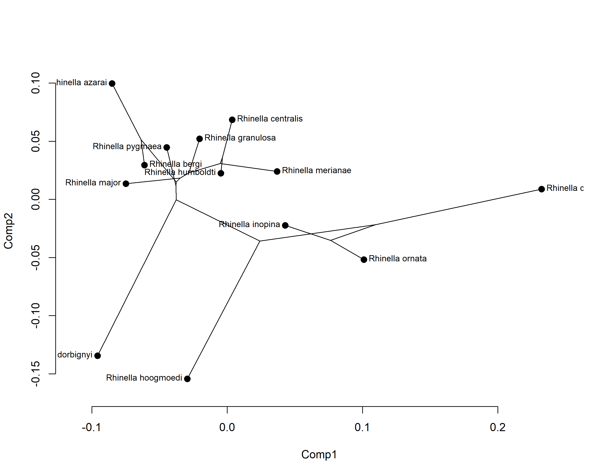

# Filogenia
Se *[nada na biologia faz sentido exceto à luz da evolução](https://doi.org/10.2307/4444260)*, então é bastante justo que a discussão sobre como varia a forma seja feita sobre uma hipótese filogenética. Nas aulas [aula 7 e 8](Aulas%207%20e%208.pdf) falamos sobre isso, trabalhando conceitos como filomorfoespaço, sinal filogenético, convergência evolutiva, PGLS, taxas de evolução da forma e forma média. Usadas em conjunto, essas abordagens são complementares na interpretação e estudo da mudança da forma. A ideia aqui não é apenas visualizar como a filogenia se sobrepõe ao morfoespaço em si, mas quantificar e representar tendências evolutivas e lidar com a dependência filogenética em análises estatísticas. Em outras palavras: estamos quantificando a evolução morfológica.
Para essa prática, usaremos o mesmo conjunto da [aula 5](contour.md) (download [clicando aqui](Rhinella.TPS)), formado por landmarks `2D` posicionados sobre imagens de sapos do gênero *Rhinella* (retiradas da literatura). Na página *Curvas e contornos: semilandmarks e análise de Fourier* você pode encontrar mais detalhes.

## 1. Ocupação do filomorfoespaço
Antes de mais nada vamos instalar alguns pacotes adicionais que serão importantes para essa prática. O primeiro deles, `convevol`, calcula os índices C1, C2, C3 e C4 de [Stayton (2015)](https://doi.org/10.1111/evo.12729). Estes índices constituem métricas complementares de convergência morfológica, baseadas na tendência de aproximação entre terminais no morfoespaço em relação às posições de ancestrais comuns. Em outras palavras, são medidas do quanto diferentes linhagens tendem a ocupar uma região similar no morfoespaço, levando-se em conta como a forma de cada linhagem varia desde sua origem. Já o outro pacote, `phylocurve`, é usado para calcular o sinal filogenético através do índice *K<sub>mult</sub>*. O *K<sub>mult</sub>* é uma extensão multivariada do *K* de [Blomberg (2003)](https://doi.org/10.1111/j.0014-3820.2003.tb00285.x), proposta por [Adams (2014)](https://doi.org/10.1093/sysbio/syu030). Na sua versão original, o *K* é calculado como a razão entre a variância observada em uma característica quando ponderada pela estrutura filogenética e a variância calculada como se os valores na característica fossem independentes. Comentamos sobre isso na aula, você pode se aprofundar no tema acessando o site do [Prof. José Alexandre F. Diniz-Filho](https://dinizfilho.wixsite.com/dinizfilholab/sinal-filogenetico). Essa abordagem, no entanto, quantifica a relação com a filogenia apenas para traços contínuos e univariados. Já o *K<sub>mult</sub>* quantifica a intensidade do sinal filogenético em dados contínuos multivariados, como é o caso da posição ocupada por uma espécie no morfoespaço (i.e., descrita por valores específicos para cada PC). Se tiverem dificuldade na instalação do `phylocurve`, tentem acessar [a página do autor](https://ericgoolsby.github.io/software.html).
```{r instalar}
# Definir o diretório de trabalho
setwd("C:/caminho/para/pasta/desejada")

# Instalando pacotes novos
#install.packages("convevol")
#remotes::install_github("ericgoolsby/phylocurve") #se houver erro, instale o pacote devtools antes
```
Ótimo! Feito isso, podemos seguir com o carregamento normal dos pacotes e dados:
```{r carregar}
# Carregar pacotes necessários
library(geomorph)
library(tidyverse)
library(phytools)
library(convevol)
library(phylocurve)

# Carregar os dados
land.dt<-readland.tps("Rhinella.TPS", specID = "imageID", readcurves = TRUE)

# Verificando o número de dimensões do nosso tps
dim(land.dt)
```
A maneira mais simples de relacionar a ocupação do morfoespaço à filogenia é através da realização de um `filomorfoespaço`. Esse será o nosso primeiro objetivo no R e, para isso, vamos precisar: `1)` ler uma filogenia ultramétrica (e idealmente datada!) disponível na literatura (clique [aqui](TreePL-Rooted_Anura_bestTree.tre) para fazer o download da filogenia de [Portik et al. 2023](https://doi.org/10.1016/j.ympev.2023.107907), a mais recente para Anura); e `2)` cortar a filogenia de modo a manter apenas os terminais para os quais temos espécies representadas (no caso, as do gênero *Rhinella* que podem ser acessadas através de `dimnames(land.dt)[[3]]`).

```{r filogenia}
# Lendo a filogenia
tree<-read.tree("TreePL-Rooted_Anura_bestTree.tre")

# Se quisermos ver as espécies que coincidem entre os dois objetos
intersect(dimnames(land.dt)[[3]], tree$tip.label)
# Sequsermos ver as espécies que não coincidem
setdiff(dimnames(land.dt)[[3]], tree$tip.label)

# Atualizaremos o objeto tree para manter apenas as espécies desejadas na filogenia 
tree <- drop.tip(tree, setdiff(tree$tip.label, 
                         dimnames(land.dt)[[3]]))
```
Basicamente, estamos selecionando as espécies que não coincidem entre a filogenia e o `.tps` com `setdiff()` e removendo-as com `drop.tip()`. Você pode rodar `plotTree(tree)` para ver a árvore antes e depois desse processo (a diferença é bastante perceptível). Feito isso, ambos os objetos terão conteúdos referentes às mesmas espécies. No entanto, estão em ordens diferentes. No `R`, isso é um problema para quaisquer análises que envolvam o uso de filogenias. E como não podemos alterar a ordem das espécies na filogenia, vamos reordenar o nosso `.tps` para que esteja adequado:
```{r reordem}
# Ordenar o conjunto de dados para que coincida com a ordem das espécies na filogenia
land.dt <- land.dt[,,match(tree$tip.label, 
                           dimnames(land.dt)[[3]])]
```
Ótimo! Imagino que a essas alturas você já saiba como consultar a nova ordem das espécies no `.tps` (usando `dimnames(land.dt)[[3]]`). Por fim, podemos rodar a análise de Procrustes e gerar o morfoespaço.
```{r procrustes}
# Defina os sliders para cada curva
c1 <- define.sliders(12:42)
c2 <- define.sliders(41:52)
c3 <- define.sliders(51:82)
c4 <- define.sliders(81:101)

# Análise de Procrustes
gpa <- gpagen(land.dt, curves = rbind(c1, c2, c3, c4), 
              ProcD = FALSE)

# PCA para gerar o morfoespaço
pca <- gm.prcomp(gpa$coords)
```
Perfeito. Agora podemos gerar, por fim, um filomorfoespaço:
```{r filomorfoespaco1}
filomsp<-phylomorphospace(tree, X = pca$x[,1:2],
                 bty="n",node.size=c(0,1.2), label = "horizontal")
```
<p align="center">

</p>
