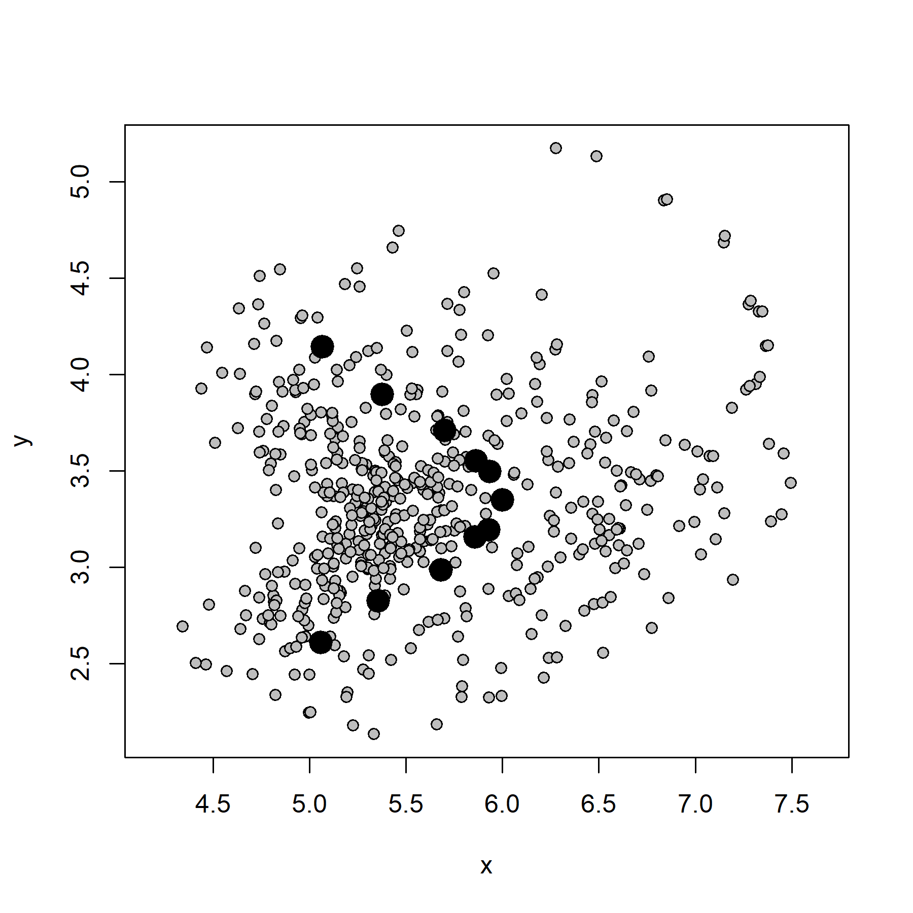
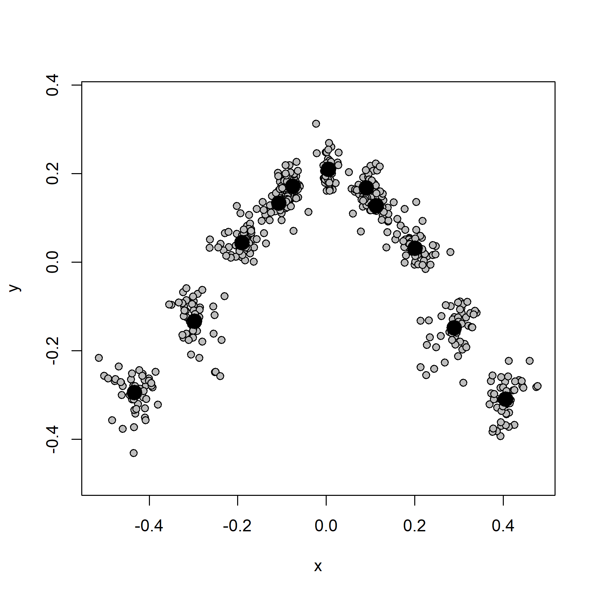
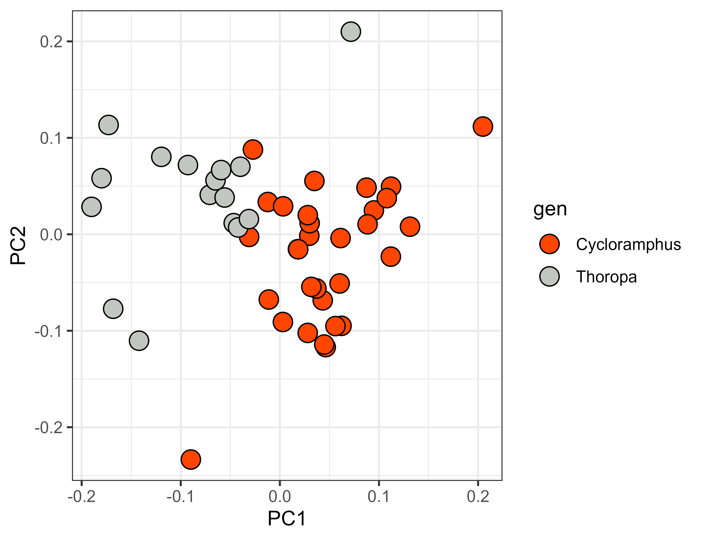
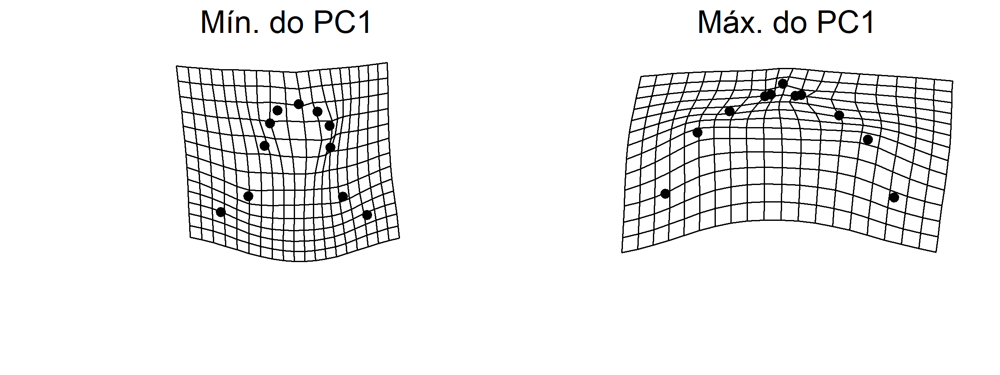
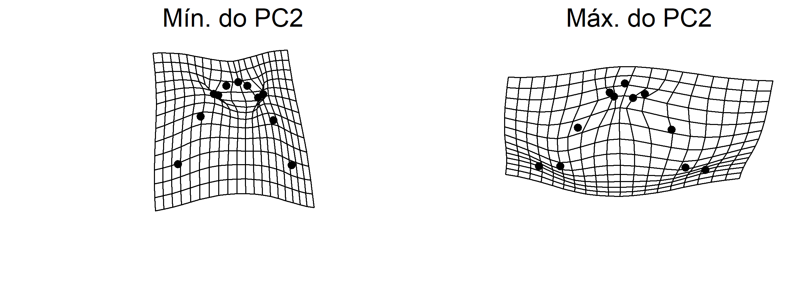
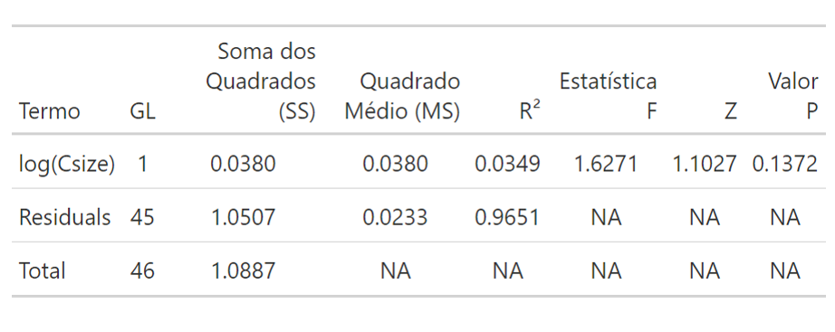

# Introdução à Morfometria Geométrica 
As aulas [3](Aula%203.pdf) e [4](Aula%204.pdf) serviram para dar um panorama introdutório do que é a morfometria geométrica (MG). Começamos trabalhando o conceito de **landmark**, fundamental na GM por se tratar do descritor básico para a forma. Além de falar sobre o contexto em que o método foi desenvolvido, abordamos como ele permite trabalhar *forma* e *tamanho* como variáveis distintas e bem definidas. E isso, por sua vez, é bastante significativo, já que a variável *tamanho* pode influenciar a *forma*: indivíduos menores tendendo a um determinado fenótipo diferente do observado em indivíduos maiores. Essa influência do tamanho sobre a forma é chamada de **alometria**, e é um dos efeitos mais comumente encontrados. Como também é comum encontrar variações em relação a um eixo central em formas supostamente simétricas, com um lado tendendo a um padrão distinto do encontrado do outro lado. Esse fenômeno é chamado **assimetria**.  
Para a parte prática, usaremos a configuração de landmarks que os alunos geraram para fotos de outra família de sapos, os Cycloramphidae. São fotos em vista dorsal de animais que compõem uma intrigante família de anfíbios, formada pelos gêneros *Cycloramphus* e *Thoropa*. O grupo é notório por ser classificado entre dois grupos ecomorfológicos: as espécies saxícolas (que habitam rochas em riachos, com girinos semiterrestres) e terrestres (que apresentam girinos terrestres nidícolas).  
A definição desses grupos encontra-se na planilha "[Dados_aula4.xlsx](Dados_aula4.xlsx)", e o arquivo .tps gerado pelos alunos (i.e., a configuração de landmarks) está disponível [aqui](TPS_Aula4.zip). Esse mesmo arquivo foi gerado utilizando os programas TpsUtil e TpsDig, criados por F. James Rohlf e que podem ser baixados [aqui](https://www.sbmorphometrics.org/). Veja os pdfs [Aula 3](Aula%203.pdf) e [Aula 4](Aula%204.pdf) para mais detalhes sobre as medidas e a parte teórica como um todo.

## 1. Análise Generalizada de Procrustes
Aqui vamos começar a utilizar um pacote bastante importante para a morfometria geométrica, o `geomorph`. Como temos múltiplos arquivos .tps, faremos a leitura de todos eles e os combinaremos em seguida no R. Para ler vários arquivos, vamos listar tudo o que termina com `".TPS"`na pasta que definimos em `setwd()`. Da seguinte maneira:  

```{r data}
# Definir o diretório de trabalho
setwd("C:/caminho/para/pasta/desejada")

# Carregar pacotes necessários
library(readxl)
library(geomorph)
library(tidyverse)

# Carregar os metadados
metadados <- read_xlsx("Dados_aula4.xlsx")

# Listando os arquivos .tps em um objeto...
lista<-list.files(pattern = ".TPS")
# (...) e usando esse objeto para leitura
land.dt<-readmulti.tps(lista, specID = "imageID")
```

Aqui estamos usando `specID = "imageID"` para utilizar o nome das fotos como local de onde extrair informação para nomear os indivíduos no `R`. Essa informação também poderia estar disponível em `specID = "ID"`, dependendo de como estivesse organizado o nosso `.tps`.  
Agora vamos adentrar uma etapa crucial na GM: a chamada *análise generalizada de Procrustes (GPA)*. Como comentado em aula, durante a GPA todos os conjuntos de landmarks são sobrepostos, rotacionados e submetidos a um fator de escala para que se tornem matematicamente comparáveis, num processo que envolve a reprojeção matricial. A obtenção da forma ajustada *Z* é dada pela fórmula abaixo:

$$
Z = \frac{1}{cs} \cdot (Y - \bar{Y}) \cdot H
$$

Veja que *Z* é dado em função do produto entre $\frac{1}{cs}$ e outros dois fatores {($Y - \bar{Y}) \cdot H$}. Explorar todo o desenvolvimento matemático por trás vai além da proposta do curso, mas é importante citar que os fatores {($Y - \bar{Y}) \cdot H$} são etapas de centralização dos conjuntos de landmarks entre si, enquanto $H$ representa a rotação de cada matriz de landmarks original. Essa centralização é um processo que leva em consideração todo o dataset e calcula sua forma média; o ponto central da configuração de landmarks que compõe essa forma média é chamado de **centróide**, e é representado pelo $\bar{Y}$. Já o fator de escala que foi necessário aplicar a cada indivíduo é chamado de **tamanho do centróide**, sendo representado por ${cs}$. Dessa maneira, a *forma* e o *tamanho* passam a ser tratados na análise como *variáveis distintas*.  

Sei que tudo isso parece complexo, mas no R é bastante simples. Trata-se de uma única linha:

```{r gpa}
# Rodando a análise de Procrustes
gpa<-gpagen(land.dt)
```

A diferença entre um conjunto de dados que foi alinhado por GPA em relação a outro que não foi é bastante perceptível. Podemos plotar a configuração original de landmarks:

```{r original}
plotAllSpecimens(land.dt)
```
<p align="center">

</p>

E compará-la com o resultado da GPA:

```{r coordprocrustes}
plotAllSpecimens(gpa)
```
<p align="center">

</p>

Em ambas as figuras anteriores, os pontos em cinza representam os landmarks de todo o dataset, enquanto os pontos pretos indicam a forma média do dataset.

## 2. Morfoespaço
Aqui vamos gerar a representação gráfica do nosso espaço da forma (o que seria chamado de espaço tangente por David Kendall), que é basicamente uma `PCA` aplicada ao dataset de landmarks.  

```{r pca}
# Gerando uma PCA da forma, ou morfoespaço
pca<-gm.prcomp(gpa$coords)

# Agrupando os três primeiros eixos da PCA em um data.frame para gerar um gráfico
df.pca<-as.data.frame(pca$x[,1:3])
# E adicionando as colunas em metadados referentes ao gênero, espécie e grupo ecomorfológico
df.pca<-cbind(df.pca,metadados[,c(2,3,5)]) #df final, com os PCs, nomes das spp e níveis de agrupamento

# Gerando o plot
ggplot(df.pca, aes(Comp1, Comp2)) +
  geom_point(aes(fill = gen), size = 4.5, shape = 21) +  # 'fill' para preenchimento, 'color' para contorno preto
  scale_fill_manual(values = c("Thoropa" = "#C2C5C1", 
                               "Cycloramphus" = "orangered")) +  # Definir cores de preenchimento
  xlab("PC1") +
  ylab("PC2") +
  theme_bw()
```
<p align="center">

</p>

A isso chamamos **morfoespaço**. Veja que cada ponto apresentado no gráfico da PCA representa um indivíduo em nossa amostra. Em outras palavras, cada ponto representa uma *forma*. A primeira informação que podemos extrair do morfoespaço é o percentual de explicação da variância explicado por cada eixo, o que pode ser acessado através dos componentes do objeto PCA (os três primeiros, por exemplo, podem ser acessados via `pca$x[,1:3]`). Além disso, é possível estimar o quanto a forma varia ao longo dos eixos, distorção essa que é obtida através de grades de deformação geradas pela função `plotRefToTarget`. Elas são apresentadas abaixo:

```{r relativewarpsPC1}
# Ajustar o layout gráfico para 1 linha e 2 colunas
par(mfrow = c(1, 2))
par(mar = c(4, 4, 2, 1))  # Ajustar margens

# Forma mínima do PC1
plotRefToTarget(M1 = gpa$consensus, M2 = pca$shapes$shapes.comp1$min)
mtext("Mín. do PC1", side = 3, line = 0.5, at = mean(par("usr")[1:2]), cex = 1.5)
# Forma máxima do PC1
plotRefToTarget(M1 = gpa$consensus, M2 = pca$shapes$shapes.comp1$max)
mtext("Máx. do PC1", side = 3, line = 0.5, at = mean(par("usr")[1:2]), cex = 1.5)

# Resetar layout gráfico ao padrão
par(mfrow = c(1, 1), mar = c(5, 4, 4, 2) + 0.1)

# Fechar o dispositivo gráfico para salvar o arquivo
dev.off()
```

Em relação ao `PC1`, a variação é:
<p align="center">

</p>


```{r relativewarpsPC2}
# Ajustar o layout gráfico para 1 linha e 2 colunas
par(mfrow = c(1, 2))
par(mar = c(4, 4, 2, 1))  # Ajustar margens

# Forma mínima do PC2
plotRefToTarget(M1 = gpa$consensus, M2 = pca$shapes$shapes.comp2$min)
mtext("Mín. do PC2", side = 3, line = 0.5, at = mean(par("usr")[1:2]), cex = 1.5)
# Forma máxima do PC2
plotRefToTarget(M1 = gpa$consensus, M2 = pca$shapes$shapes.comp2$max)
mtext("Máx. do PC2", side = 3, line = 0.5, at = mean(par("usr")[1:2]), cex = 1.5)

# Resetar layout gráfico ao padrão
par(mfrow = c(1, 1), mar = c(5, 4, 4, 2) + 0.1)
```

(...) enquanto que a variação da forma no `PC2` foi de:
<p align="center">

</p>

## 3. Alometria
Essa distorção da forma pode ser influenciada por diversos fatores: tamanho, assimetria, ecomorfologia, dieta, ontogenia, etc. Nesta aula, vamos explorar os dois primeiros deles, começando pelo tamanho. Imagine uma amostra hipotética em que indivíduos menores têm a cabeça *arredondada*, enquanto indivíduos maiores apresentam a cabeça em formato *triangular*. Talvez a maioria dos casos reais não sejam assim tão óbvios, mas o tamanho comumente influencia na forma de estruturas biológicas, muitas vezes por limitar seu desenvolvimento. E já que agora sabemos que *tamanho* e *forma* são variáveis distintas e bem definidas após uma GPA, podemos testar como funciona a relação entre elas. Para isso, vamos usar a função `procD.lm` para realizar uma regressão linear de Procrustes.   

```{r procDlm}
# Testando a alometria
m<-procD.lm(coords ~ log(Csize)*df.pca$gen, 
                   data = gpa, iter = 9999) 
summary(m)
```
<p align="center">

</p>

Veja que `log(Csize)` tem `Valor p > 0,05`, de modo que o efeito do tamanho sobre a forma não é diferente do que seria esperado ao acaso.
