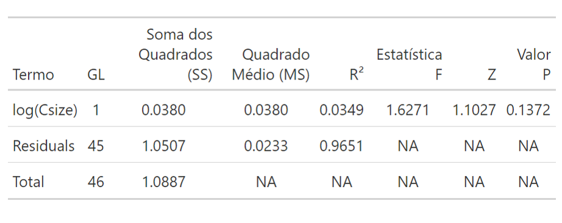
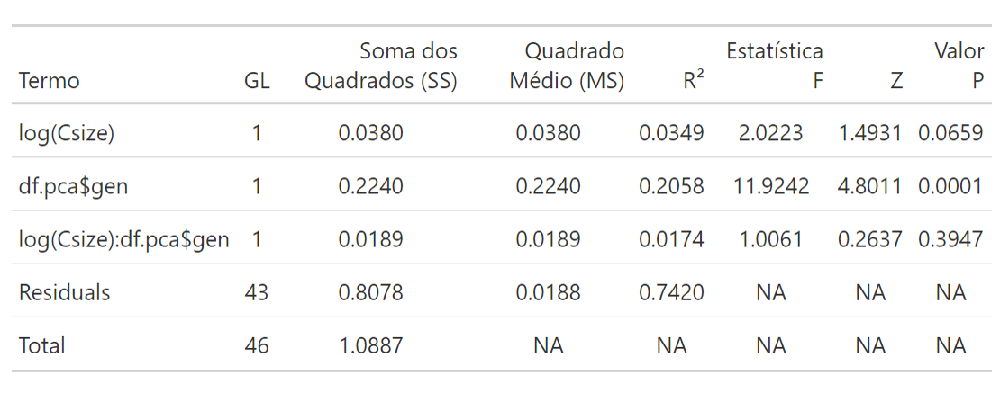
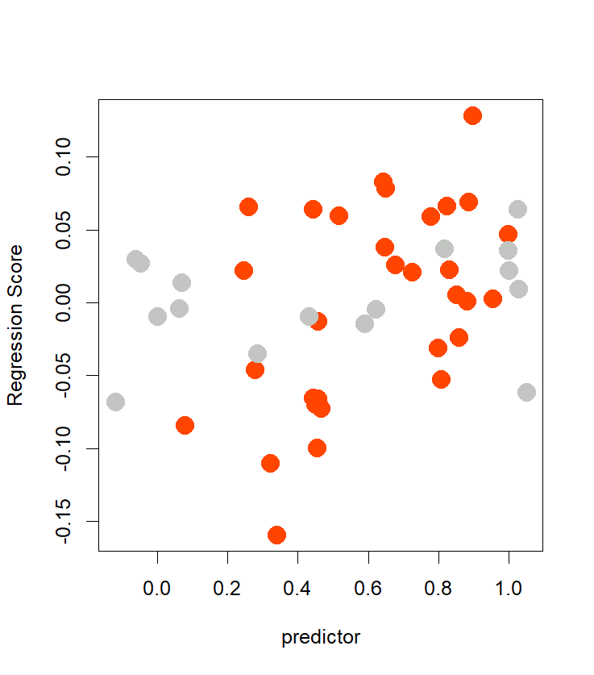
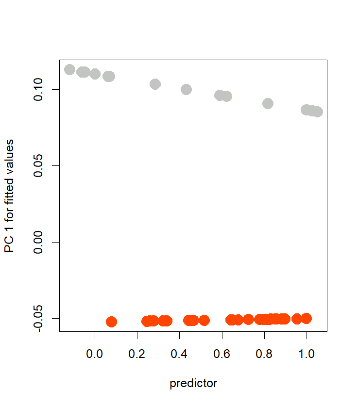
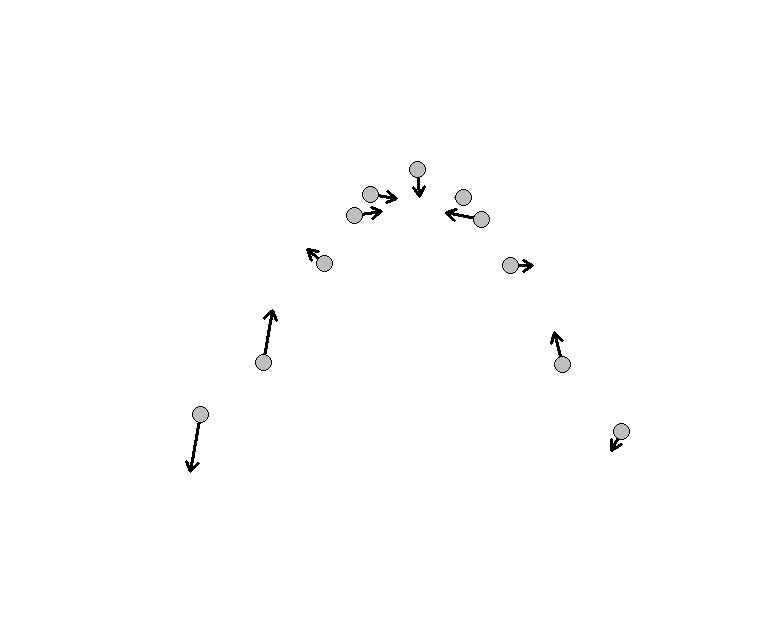
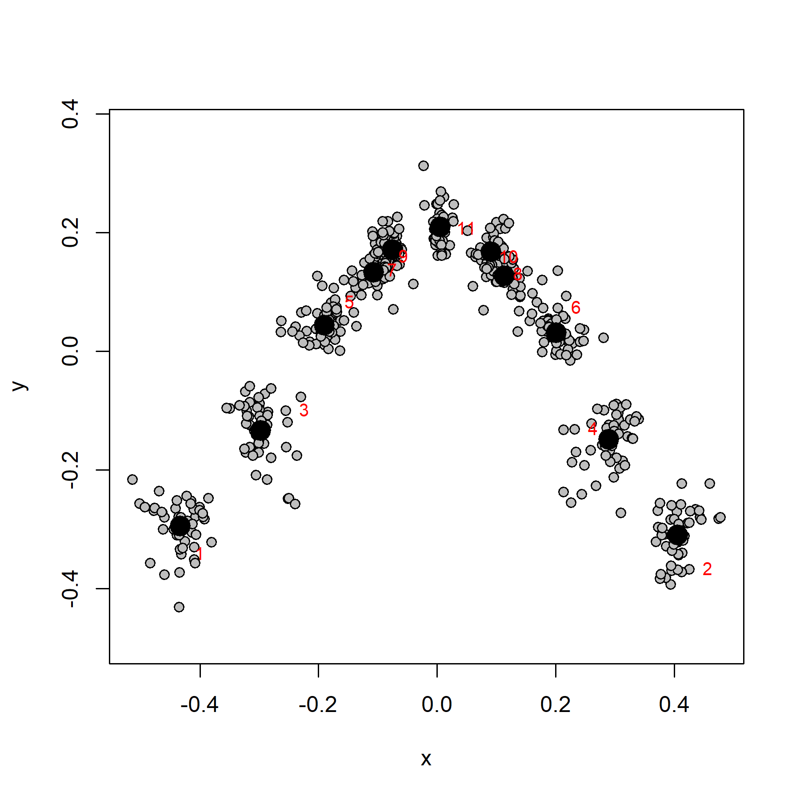
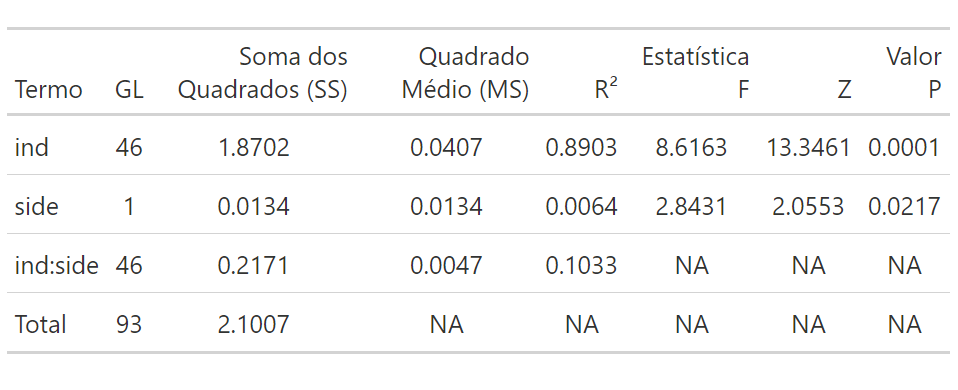
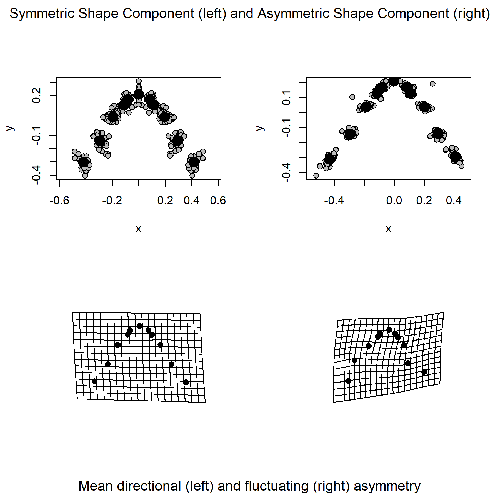
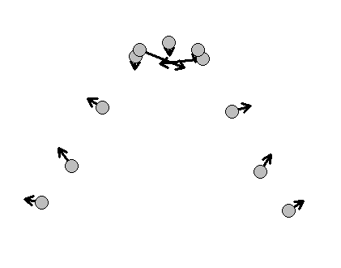

# Introdução à Morfometria Geométrica 
As aulas [3](Aula%203.pdf) e [4](Aula%204.pdf) serviram para dar um panorama introdutório do que é a morfometria geométrica (MG). Começamos trabalhando o conceito de **landmark**, fundamental na GM por se tratar do descritor básico para a forma. Além de falar sobre o contexto em que o método foi desenvolvido, abordamos como ele permite trabalhar *forma* e *tamanho* como variáveis distintas e bem definidas. E isso, por sua vez, é bastante significativo, já que a variável *tamanho* pode influenciar a *forma*: indivíduos menores tendendo a um determinado fenótipo diferente do observado em indivíduos maiores. Essa influência do tamanho sobre a forma é chamada de **alometria**, e é um dos efeitos mais comumente encontrados. Como também é comum encontrar variações em relação a um eixo central em formas supostamente simétricas, com um lado tendendo a um padrão distinto do encontrado do outro lado. Esse fenômeno é chamado **assimetria**.  
Para a parte prática, usaremos a configuração de landmarks que os alunos geraram para fotos de outra família de sapos, os Cycloramphidae. São fotos em vista dorsal de animais que compõem uma intrigante família de anfíbios, formada pelos gêneros *Cycloramphus* e *Thoropa*. O grupo é notório por ser classificado entre dois grupos ecomorfológicos: as espécies saxícolas (que habitam rochas em riachos, com girinos semiterrestres) e terrestres (que apresentam girinos terrestres nidícolas).  
A definição desses grupos encontra-se na planilha "[Dados_aula4.xlsx](Dados_aula4.xlsx)", e o arquivo .tps gerado pelos alunos (i.e., a configuração de landmarks) está disponível [aqui](TPS_Aula4.zip). Esse mesmo arquivo foi gerado utilizando os programas TpsUtil e TpsDig, criados por F. James Rohlf e que podem ser baixados [aqui](https://www.sbmorphometrics.org/). Veja os pdfs [Aula 3](Aula%203.pdf) e [Aula 4](Aula%204.pdf) para mais detalhes sobre as medidas e a parte teórica como um todo.

## 1. Análise Generalizada de Procrustes
Aqui vamos começar a utilizar um pacote bastante importante para a morfometria geométrica, o `geomorph`. Como temos múltiplos arquivos .tps, faremos a leitura de todos eles e os combinaremos em seguida no R. Para ler vários arquivos, vamos listar tudo o que termina com `".TPS"`na pasta que definimos em `setwd()`. Da seguinte maneira:  

```{r data}
# Definir o diretório de trabalho
setwd("C:/caminho/para/pasta/desejada")

# Carregar pacotes necessários
library(readxl)
library(geomorph)
library(tidyverse)

# Carregar os metadados
metadados <- read_xlsx("Dados_aula4.xlsx")

# Listando os arquivos .tps em um objeto...
lista<-list.files(pattern = ".TPS")
# (...) e usando esse objeto para leitura
land.dt<-readmulti.tps(lista, specID = "imageID")
```

Aqui estamos usando `specID = "imageID"` para utilizar o nome das fotos como local de onde extrair informação para nomear os indivíduos no `R`. Essa informação também poderia estar disponível em `specID = "ID"`, dependendo de como estivesse organizado o nosso `.tps`.  
Agora vamos adentrar uma etapa crucial na GM: a chamada *análise generalizada de Procrustes (GPA)*. Como comentado em aula, durante a GPA todos os conjuntos de landmarks são sobrepostos, rotacionados e submetidos a um fator de escala para que se tornem matematicamente comparáveis, num processo que envolve a reprojeção matricial. A obtenção da forma ajustada *Z* é dada pela fórmula abaixo:

$$
Z = \frac{1}{cs} \cdot (Y - \bar{Y}) \cdot H
$$

Veja que *Z* é dado em função do produto entre $\frac{1}{cs}$ e outros dois fatores {($Y - \bar{Y}) \cdot H$}. Explorar todo o desenvolvimento matemático por trás vai além da proposta do curso, mas é importante citar que os fatores {($Y - \bar{Y}) \cdot H$} são etapas de centralização dos conjuntos de landmarks entre si, enquanto $H$ representa a rotação de cada matriz de landmarks original. Essa centralização é um processo que leva em consideração todo o dataset e calcula sua forma média; o ponto central da configuração de landmarks que compõe essa forma média é chamado de **centróide**, e é representado pelo $\bar{Y}$. Já o fator de escala que foi necessário aplicar a cada indivíduo é chamado de **tamanho do centróide**, sendo representado por ${cs}$. Dessa maneira, a *forma* e o *tamanho* passam a ser tratados na análise como *variáveis distintas*.  

Sei que tudo isso parece complexo, mas no R é bastante simples. Trata-se de uma única linha:

```{r gpa}
# Rodando a análise de Procrustes
gpa<-gpagen(land.dt)
```

A diferença entre um conjunto de dados que foi alinhado por GPA em relação a outro que não foi é bastante perceptível. Podemos plotar a configuração original de landmarks:

```{r original}
plotAllSpecimens(land.dt)
```
<p align="center">

</p>

E compará-la com o resultado da GPA:

```{r coordprocrustes}
plotAllSpecimens(gpa)
```
<p align="center">

</p>

Em ambas as figuras anteriores, os pontos em cinza representam os landmarks de todo o dataset, enquanto os pontos pretos indicam a forma média do dataset.

## 2. Morfoespaço
Aqui vamos gerar a representação gráfica do nosso espaço da forma (o que seria chamado de espaço tangente por David Kendall), que é basicamente uma `PCA` aplicada ao dataset de landmarks.  

```{r pca}
# Gerando uma PCA da forma, ou morfoespaço
pca<-gm.prcomp(gpa$coords)

# Agrupando os três primeiros eixos da PCA em um data.frame para gerar um gráfico
df.pca<-as.data.frame(pca$x[,1:3])
# E adicionando as colunas em metadados referentes ao gênero, espécie e grupo ecomorfológico
df.pca<-cbind(df.pca,metadados[,c(2,3,5)]) #df final, com os PCs, nomes das spp e níveis de agrupamento

# Gerando o plot
ggplot(df.pca, aes(Comp1, Comp2)) +
  geom_point(aes(fill = gen), size = 4.5, shape = 21) +  # 'fill' para preenchimento, 'color' para contorno preto
  scale_fill_manual(values = c("Thoropa" = "#C2C5C1", 
                               "Cycloramphus" = "orangered")) +  # Definir cores de preenchimento
  xlab("PC1") +
  ylab("PC2") +
  theme_bw()
```
<p align="center">

</p>

A isso chamamos **morfoespaço**. Veja que cada ponto apresentado no gráfico da PCA representa um indivíduo em nossa amostra. Em outras palavras, cada ponto representa uma *forma*. A primeira informação que podemos extrair do morfoespaço é o percentual de explicação da variância explicado por cada eixo, o que pode ser acessado através dos componentes do objeto PCA (os três primeiros, por exemplo, podem ser acessados via `pca$x[,1:3]`). Além disso, é possível estimar o quanto a forma varia ao longo dos eixos, distorção essa que é obtida através de grades de deformação geradas pela função `plotRefToTarget`. Elas são apresentadas abaixo:

```{r relativewarpsPC1}
# Ajustar o layout gráfico para 1 linha e 2 colunas
par(mfrow = c(1, 2))
par(mar = c(4, 4, 2, 1))  # Ajustar margens

# Forma mínima do PC1
plotRefToTarget(M1 = gpa$consensus, M2 = pca$shapes$shapes.comp1$min)
mtext("Mín. do PC1", side = 3, line = 0.5, at = mean(par("usr")[1:2]), cex = 1.5)
# Forma máxima do PC1
plotRefToTarget(M1 = gpa$consensus, M2 = pca$shapes$shapes.comp1$max)
mtext("Máx. do PC1", side = 3, line = 0.5, at = mean(par("usr")[1:2]), cex = 1.5)

# Resetar layout gráfico ao padrão
par(mfrow = c(1, 1), mar = c(5, 4, 4, 2) + 0.1)

# Fechar o dispositivo gráfico para salvar o arquivo
dev.off()
```

Em relação ao `PC1`, a variação é:
<p align="center">

</p>


```{r relativewarpsPC2}
# Ajustar o layout gráfico para 1 linha e 2 colunas
par(mfrow = c(1, 2))
par(mar = c(4, 4, 2, 1))  # Ajustar margens

# Forma mínima do PC2
plotRefToTarget(M1 = gpa$consensus, M2 = pca$shapes$shapes.comp2$min)
mtext("Mín. do PC2", side = 3, line = 0.5, at = mean(par("usr")[1:2]), cex = 1.5)
# Forma máxima do PC2
plotRefToTarget(M1 = gpa$consensus, M2 = pca$shapes$shapes.comp2$max)
mtext("Máx. do PC2", side = 3, line = 0.5, at = mean(par("usr")[1:2]), cex = 1.5)

# Resetar layout gráfico ao padrão
par(mfrow = c(1, 1), mar = c(5, 4, 4, 2) + 0.1)
```

(...) enquanto que a variação da forma no `PC2` foi de:
<p align="center">

</p>

## 3. Alometria
Essa distorção da forma pode ser influenciada por diversos fatores: tamanho, assimetria, ecomorfologia, dieta, ontogenia, etc. Nesta aula, vamos explorar os dois primeiros deles, começando pelo tamanho. Imagine uma amostra hipotética em que indivíduos menores têm a cabeça *arredondada*, enquanto indivíduos maiores apresentam a cabeça em formato *triangular*. Talvez a maioria dos casos reais não sejam assim tão óbvios, mas o tamanho comumente influencia na forma de estruturas biológicas, muitas vezes por limitar seu desenvolvimento. E já que agora sabemos que *tamanho* e *forma* são variáveis distintas e bem definidas após uma GPA, podemos testar como funciona a relação entre elas. Esse efeito é chamado **alometria**. Para isso, vamos usar a função `procD.lm` para realizar uma regressão linear de Procrustes.   

```{r procDlm}
# Testando a alometria
m1<-procD.lm(coords ~ log(Csize), 
                   data = gpa, iter = 9999) 
summary(m1)
```
<p align="center">

</p>

Veja que `log(Csize)` tem `Valor p > 0,05`, de modo que o efeito do tamanho sobre a forma não é diferente do que seria esperado ao acaso. É sempre válido analisar como seu nível de agrupamento de interesse pode mascarar esse efeito. Se sua amostra for composta por espécies diferentes, por exemplo, talvez algumas delas apresentem distorção alométrica, enquanto outras não. Para verificar isso, as variáveis preditoras do modelo devem ser testadas como produto entre `log(Csize)` e o seu `nível de agrupamento` de interesse. Na nossa amostra, vamos testar se os dois *gêneros* apresentam diferenças alométricas. 

```{r procDlmgr}
# Testando a alometria, levando os gêneros em consideração
m2<-procD.lm(coords ~ log(Csize)*df.pca$gen, 
                   data = gpa, iter = 9999) 
summary(m2)
```
<p align="center">

</p>

Vemos que, novamente, a alometria não foi constatada nos dados. Apenas para explorarmos melhor nosso conjunto de dados, vamos gerar alguns plots que permitem interpretar a relação entre *tamanho* e *forma* na nossa amostra. Isso não se faz necessário nesse caso específico (já que a alometria não foi significativa), mas quero apresentar as ferramentas visuais que temos para entender melhor esse efeito. 

Primeiramente, vamos aos plots. Usaremos a função `plotAllometry()` para gerar gráficos alométricos, com cores distintas para cada um dos gêneros. A função aceita uma série de métodos para relacionar as nossas variáveis de interesse, mas os dois mais comumente empregados são o `RegScore` e o `PredLine`. O primeiro, `RegScore`, representa uma regressão entre a projeção da forma no PC1 do morfoespaço e a variável de tamanho considerada ([Drake & Klingenberg, 2007](https://royalsocietypublishing.org/doi/10.1098/rspb.2007.1169)).

```{r regscore}
# Testando a alometria, levando os gêneros em consideração
cores <- ifelse(df.pca$gen == "Thoropa", "#C2C5C1",
                ifelse(df.pca$gen  == "Cycloramphus", "orangered", NA))

alom.rscr<-plotAllometry(m2, size = gpa$Csize, logsz = TRUE,
              method = "RegScore",
              pch=20, cex=3, col=cores)
```
<p align="center">

</p>


Veja que os dados são apresentados com certa dispersão, o que torna mais difícil a visualização de padrões ou tendências. Por esse motivo, [Adams e Nistri (2010)](https://bmcecolevol.biomedcentral.com/articles/10.1186/1471-2148-10-216) propuseram uma linearização alométrica baseada em uma complexa reprojeção de matrizes, o `PredLine`. Apesar de matematicamente mais complicado, o método permite observar tendências de maneira bastante direta.

```{r predline}
alom.pdln<-plotAllometry(m2, size = gpa$Csize, logsz = TRUE,
              method = "PredLine",
              pch=20, cex=3, col=cores)
```
<p align="center">

</p>

Repare que `PC1 for fitted values` (ou o `eixo y` no gráfico do `plotAllometry()` quando `method = "PredLine"`) é uma medida da variabilidade de formas encontradas na nossa amostra. Repare ainda que no nosso caso as duas retas se encontram basicamente alinhadas ao `eixo x`; em outras palavras a forma em *Cycloramphus* e *Thoropa* muda muito pouco sua forma em relação ao incremento do tamanho. Isso está de acordo com a ausência de efeito alométrico constatada pelo p-valor de `procD.lm()`, e podemos dizer que a relação entre `forma` e `tamanho` é **isométrica**. De qualquer forma, podemos a função `shape.predictor()` para inspecionar como essa relação está representada no nosso caso. 

```{r shapepredictor}
#Definindo a forma esperada com o mínimo e o máximo de tamanho na amostra
preds <- shape.predictor(gpa$coords, x= log(gpa$Csize),
                         Intercept = TRUE, 
                         predmin = min(log(gpa$Csize)), 
                         predmax = max(log(gpa$Csize))) 

plotRefToTarget(M1 = preds$predmin, M2 = preds$predmax, mag=2.2,
                method = "vector", useRefPts = F)
```
<p align="center">

</p>

A `shape.predictor()` é uma função bastante útil, e pode ser utilizada em outras situações. Aqui a ideia é que os pontos cinza representam os landmarks da forma referente ao tamanho mínimo (ou seja, a forma esperada por `predmin = min(log(gpa$Csize))`), enquanto o final das setas indica a forma esperada com o tamanho máximo (i.e., a forma quando `predmax = max(log(gpa$Csize))`). O argumento `method = "vector"` serve justamente para gerar essas setas, e poderia ser substituído por `method = "TPS"` se você preferir a grade de deformação, por exemplo.

## 4. Assimetria
Por fim, testamos na aula um último efeito: a **assimetria**. Por distintas razões, pode haver uma tendência à uma desigualdade morfológica em lados opostos de um eixo de simetria. No nosso exemplo, é como se o lado direito e o lado esquerdo da cabeça dos *Cycloramphidae* fossem diferentes. Para testar assimetria, precisamos indicar quais são os pares de landmarks que seriam considerados simétricos entre si. Melhor visualizar os landmarks em ordem antes de fazer isso:  

```{r ordemlandmarks} 
# Plotando todos os landmarks
plotAllSpecimens(gpa$coords)
# Adicionar os números dos landmarks em vermelho
text(gpa$coords[, , 1], labels = 1:nrow(gpa$coords), 
     col = "red", cex = 0.8) # Ajuste `cex` conforme necessário
```
<p align="center">

</p>

Agora sabemos que o único landmark não-pareado é o **11**. Então definimos os pares em um novo objeto, que será repassado à função `bilat.symmetry()`. No nosso caso, queremos testar a assimetria dentro de uma única configuração de landmarks, por isso devemos indicar `object.sym = TRUE`.  

```{r bilatsymm} 
# Definindo os pares
pares <- matrix(data = c(1,2,
                         3,4,
                         5,6,
                         7,8,
                         9,10),
                  ncol = 2, byrow = TRUE)

# Realizando o teste
bilat <- bilat.symmetry(gpa, object.sym = TRUE,
                         ind = dimnames(gpa$coords)[[3]],
                         land.pairs = pares, iter = 9999)
summary(bilat)
```

<p align="center">

</p>

Veja que aqui foram testados dois fatores, `ind` e `side`. O primeiro deles, `ind`, tem a ver com um conceito chamado *assimetria flutuante*, e foi pensado como um teste para acessá-la. Trata-se da diferença entre lados esquerdo e direito (ou ao longo de outro eixo de simetria) que não é causada por influências externas ou estruturais e, em vez disso, resulta de variações menores que ocorrem *entre indivíduos* (da mesma espécie, ou outro nível de agrupamento) em resposta a fatores ambientais ou biológicos. Mas na `bilat.symmetry()` o termo `ind` está testando apenas se a forma é distinta entre indivíduos, não isola especificamente as variações entre lados esquerdo e direito dentro de cada indivíduo. Sendo assim, a assimetria flutuante deveria ser testada pela interação entre `ind:side`, mas ela não tem p-valor associado na função e iria requerer testes adicionais. Então vamos focar no segundo fator, `side`. Ele verifica a existência da chamada *assimetria direcional*, que seria um padrão geral dentro da amostra. Na assimetria direcional existe a diferenciação da forma de um lado de maneira consistente em relação ao outro. É como o caso de espécies de peixes em que a maior parte dos indivíduos *tende* a ter a nadadeira esquerda consistentemente maior do que a nadadeira direita, por exemplo. Vemos que nossos dados apresentam esse efeito (`p-valor = 0,02` para o fator `side`), embora seja um efeito pequeno em relação às diferenças individuais (<i>R</i><sup>2</sup><sub>ind</sub> = 0.89; <i>R</i><sup>2</sup><sub>side</sub> < 0.01).

```{r plotassim} 
# Plotando o modelo
plot(bilat)
```

<p align="center">

</p>

Ao plotar o nosso modelo do teste de assimetria, obtemos um painel cheio de informações gráficas. As duas plotagens na parte superior se assemelham bastante à saída da função `plotAllSpecimens()`, porque a ideia aqui também é entender a forma média dos dados e a distribuição dos landmarks de todos os indivíduos. O painel superior esquerdo, `Symmetric Shape Component` se refere a um cenário hipotético: como se esperaria que se distribuissem os landmarks da nossa amostra caso não houvesse *nenhuma assimetria*. Veja que isso não reflete a realidade, que é representada pelo painel superior direito, `Assymmetric Shape Component`. Nele, são apresentadas as variações assimétricas entre os lados esquerdo e direito, o que captura tanto a *assimetria direcional* quanto *flutuante* (ainda que não testada, como já discutimos) na morfologia dos indivíduos. Ambas são exploradas nas grades de distorção da parte de baixo do painel, e refletem a diferença existente entre o componente simétrico da forma (teórico) e os dados reais. No caso da assimetria direcional, `Mean Directional Asymmetry`é visualizada como a forma que se esperaria se todos os indivíduos tivessem o mesmo padrão de assimetria, sendo calculada como a média das assimetrias observadas entre todos os indivíduos em relação a um lado específico. Já na assimetria flutuante, `Mean Fluctuating Asymmetry` a função foca mais nas diferenças sistemáticas *entre os lados*.  

Por fim, existe queria comentar que a `bilat.symmetry()` calcula um índice de assimetria; quanto menos simétrico for um indivíduo em relação à forma média da nossa amostra, maior vai ser esse índice. Ele pode ser acessado usando `bilat$unsigned.AI`. Podemos utilizá-lo para visualizar o quão assimétrico pode ser nosso conjunto de dados. Abaixo, estamos usando a função `which()` para acessar a variação entre o indivíduo *menos* e o *mais* assimétrico que temos:

```{r limitesassimetria} 
# Acessando a variação da forma entre o indivíduo com menor e maior assimetria na amostra
plotRefToTarget(gpa$coords[,,which(dimnames(gpa$coords)[[3]]==names(which.min(bilat$unsigned.AI)))],
                gpa$coords[,,which(dimnames(gpa$coords)[[3]]==names(which.max(bilat$unsigned.AI)))], 
                mag = 0.75,  method = "vector") 
```

<p align="center">

</p>

