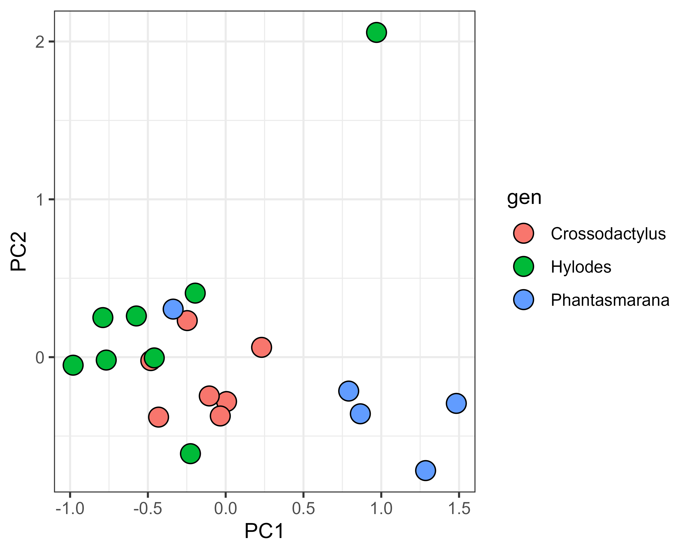
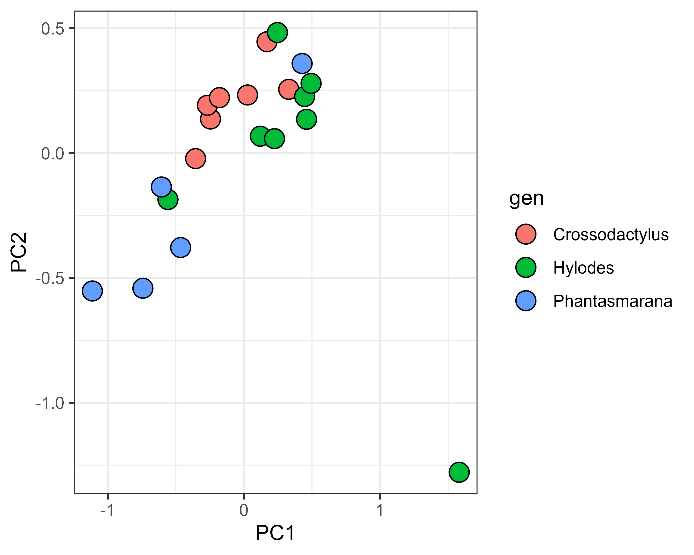
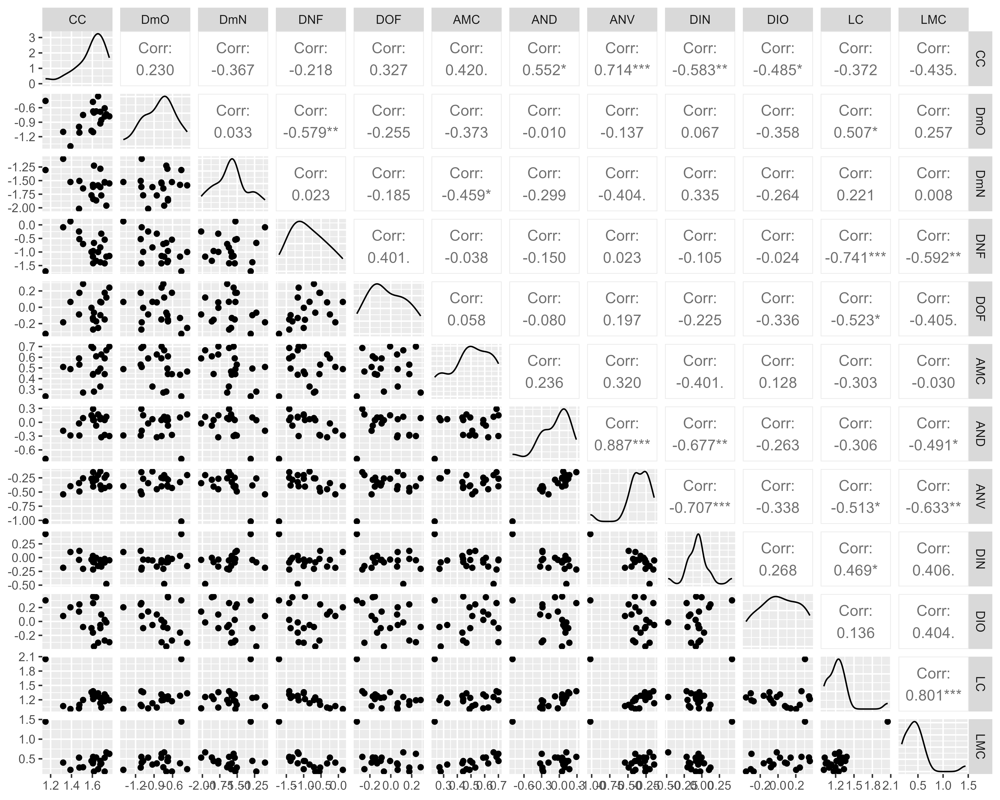
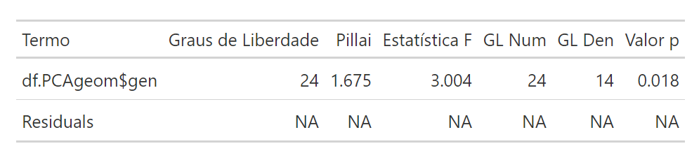
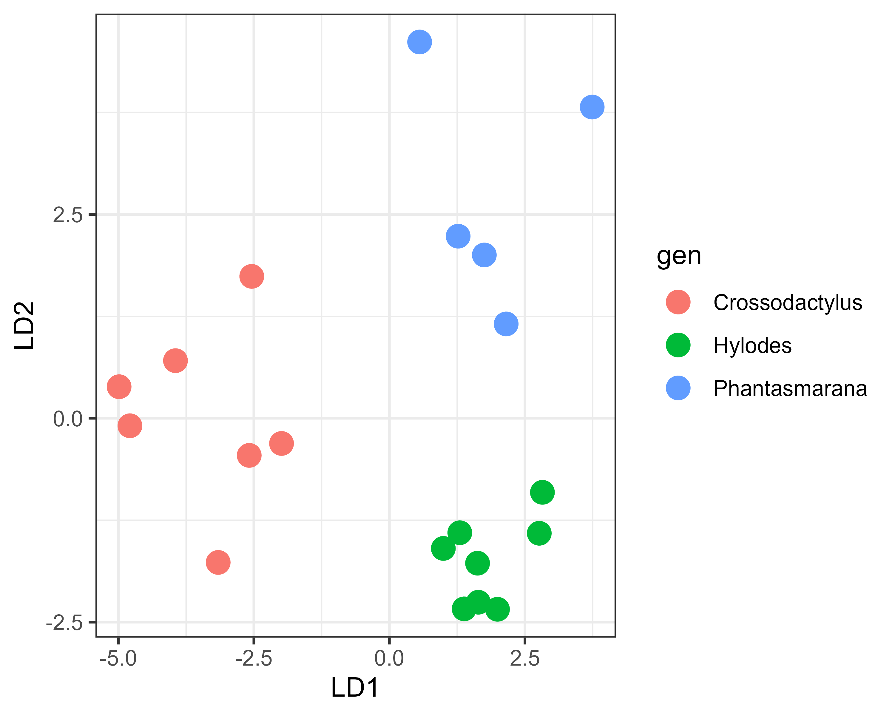

# Morfometria Linear 
Começamos as aulas [1](Aula%201.pdf) e [2](Aula%202.pdf) tratando de morfometria linear. A ideia aqui é contextualizar seu uso ao longo do tempo e discutir sobre as abordagens estatísticas mais adequadas para esse tipo de dado. Já a atividade prática envolveu o uso do programa [ImageJ](https://imagej.net/software/fiji/downloads) para a obtenção de medidas lineares a partir de [fotos de girinos disponíveis na literatura](Fotos_Aula1.zip). Acontece que a família Hylodidae, aqui usada como exemplo, possui dois gêneros (_Megaelosia_ e _Phantasmarana_) cujas larvas podem chegar a ± 12cm, e outros dois (_Crossodactylus_ e _Hylodes_) que apresentam girinos de ± 4cm. Será que as medidas lineares são suficientes pra sugerir que esses bichos diferem entre si, ou será que toda a diferença encontrada reside na discrepância do tamanho?
Para testar isso, usaremos os dados obtidos pelos alunos e salvos na planilha "[Dados_aula1.xlsx](Dados_aula1.xlsx)". 

## 1. Resíduos das medidas lineares pelo tamanho
Uma abordagem bastante aceita envolve a remoção do efeito do tamanho através de uma propriedade estatística: os resíduos de um modelo. Vamos começar indicando nossa pasta de trabalho, carregando os pacotes e importando os dados diretamente de uma planilha do Excel. Se você abrir a planilha no computador, repare que as medidas lineares foram tomadas entre as colunas C e O, enquanto A e B são as colunas que designam a que espécie e gênero cada indivíduo pertence. 

```{r data}
# Definir o diretório de trabalho
setwd("C:/caminho/para/pasta/desejada")

# Carregar pacotes necessários
library(readxl)
library(missMDA)
library(nlme)
library(tidyverse)
library(MASS)

# Carregar os metadados
metadados <- read_xlsx("Dados_aula1.xlsx", sheet = 'Aula1', range = cell_cols("A:B"))

# Carregar os dados numéricos
dados <- read_xlsx("Dados_aula1.xlsx", sheet = 'Aula1', range = cell_cols("C:O"), col_types = 'numeric')
```

**Estimar os NA**  
Um problema comum na morfometria linear é a impossibilidade de tomar uma ou mais medidas de algum(ns) indivíduo(s). Existem algumas maneiras de lidar com esse tipo de questão, como remover a variável ou o espécime (quando isso não parecer impactar de maneira importante no conjunto de dados) ou buscar um método de inferência para indicar qual seria o valor esperado. Aqui aplicaremos essa segunda abordagem. Para isso, seguiremos a proposta de [Josse & Husson 2016](https://doi.org/10.18637/jss.v070.i01), um método que se baseia na análise de componentes principais. 

```{r missMDA, echo=FALSE, eval=FALSE}
# Estimar o número ótimo de componentes principais para imputar os dados faltantes
nb <- estim_ncpPCA(dados, ncp.min = 0, ncp.max = 5, method.cv = "Kfold", nbsim = 1000)
nb # Número ótimo de componentes principais

# Imputar os valores faltantes
res.impute <- imputePCA(dados, ncp = nb$ncp)
dados <- round(res.impute$completeObs, 1)
rownames(dados) <- metadados$spp
```

**Transformação por log**  
Uma vez que o conjunto de dados esteja completo, é necessário transformá-lo de modo que os dados estejam em uma mesma escala. Para isso, aqui transformaremos os dados através de seu logaritmo. Entre outras vantagens dessa abordagem, ela reduz o efeito de valores extremos na amostra e normaliza sua distribuição. É válido comentar que a forma como é usada a função `log()` abaixo converte os dados originais para seu logaritmo natural (neperiano), dado que não indicamos um valor para a base. Consulte o help da função para mais detalhes.

```{r data_v2, echo=FALSE, eval=TRUE}
# Transformar os dados com logaritmo natural
dados <- log(dados)
```

**Modelo de regressão linear (RL)**  
Dado que queremos remover o efeito do tamanho para analisar se continua existindo diferenciação entre as medidas morfológicas, vamos empregar aqui uma regressão linear múltipla. A ideia aqui se aproveita de uma propriedade estatística. Quando criamos um modelo para testar se uma variável *y* na natureza pode ser explicada por outra *x*, sabemos que essa relação não será perfeita: existe uma certa variação nos valores de *y* que está além do que *x* pode explicar. Esse distanciamento entre o que seria esperado em um modelo perfeito e o que de fato observamos nos dados recebe o nome de *resíduo*. Então se gerarmos um modelo em que testamos se todas as medidas são explicadas pelo tamanho, os resíduos desse modelo estarão minimamente livres do efeito do tamanho em si.  

```{r dividir, echo=FALSE, eval=TRUE}
# Definir variáveis de medidas e tamanho
medidas <- as.matrix(dados[, 2:ncol(dados)])
size <- dados[, 1]

# Ajustar um modelo de regressão
regr <- gls(medidas ~ size)
summary(regr)
```

**Análise de componentes principais (PCA)**  
Uma PCA é uma análise que visa reduzir a dimensionalidade dos dados através da maximização da explicação da variância, o que é feito encontrando eixos que representam combinações lineares das variáveis originais e que são perpendiculares entre si. [Esse vídeo](https://youtu.be/FgakZw6K1QQ) pode ser bastante esclarecedor para quem quiser entender melhor como funciona essa análise

```{r pca, echo=FALSE}
# PCA com os resíduos da regressão
pca.res <- prcomp(regr$residuals)
summary(pca.res)

# Preparar os dados para o gráfico
df.PCAres <- data.frame(spp = metadados$spp, 
                        gen = metadados$gen, 
                        PC1 = pca.res$x[, 1], 
                        PC2 = pca.res$x[, 2], 
                        PC3 = pca.res$x[, 3])

# Gráfico da PCA (PC1 vs PC2)
ggplot(df.PCAres, aes(PC1, PC2)) +
  geom_point(aes(fill = gen), color = "black", size = 4.5, pch = 21, show.legend = TRUE) +
  xlab("PC1") +
  ylab("PC2") +
  theme_bw()
```
<p align="center">

</p>

## 2. Log-shape ratios
Outra abordagem bastante robusta consiste na transformação dos dados pela sua média geométrica, uma metodologia conhecida como *log-shape ratios*. Seu autor, James E. Mosimann, era parte importante em um dos grandes debates da segunda metade do século passado no estudo morfológico. Em conjunto com Stephen Jay Gould, o renomado paleontólogo e divulgador científico, defendiam que existia uma *covariância* entre forma e tamanho, a que chamavam alometria. Se existe uma *covariância*, então existe uma aproximação matemática capaz de *isolar os dois efeitos*. Coube a Mosimann demonstrar isso matematicamente. Ele partiu da correção de cada uma das medidas de um indivíduo pela média geométrica de todas as medidas daquele indivíduo:  

$$
G = \left( \prod_{i=1}^{n} X_i \right)^{\frac{1}{n}}
$$

Uma vez que a média geométrica é calculada através do produto de seus elementos, o efeito do tamanho atuante sobre cada uma das medidas isoladamente passa a ser "acumulado" segundo sempre uma mesma escala, um mesmo *fator*. A seguir, os dados são transformados por seu logaritmo. Dada a propriedade de que o `log` de uma divisão é igual ao logaritmo do numerador menos o logaritmo do denominador, o log desse *fator* é removido do conjunto de dados     

$$
\log\left(\frac{X_i}{G}\right) = \log(X_i) - \log(G)
$$

Na prática, é mais simples do que parece. Primeiro amos ler o conjunto de dados novamente, sem a coluna `C` que se refere ao tamanho dos girinos. Como esse conjunto de dados tem alguns `NA`, vamos novamente imputar os os valores faltantes.

```{r medidas2, echo=FALSE}
medidas2<-read_xlsx("Dados_aula1.xlsx", sheet='Aula1', 
                 range = cell_cols("D:O"), 
                 col_types = 'numeric') #análise SEM o tamanho
#Resolvendo os missing: estimar
nb<-estim_ncpPCA(medidas2, ncp.min = 0, ncp.max = 5, 
                 method.cv = "Kfold", nbsim = 1000)

res.impute <- imputePCA(medidas2, ncp = nb$ncp)
medidas2<-round(res.impute$completeObs,1)
rownames(medidas2)<-metadados$spp
```

Agora sim, vamos corregir os dados pela média geométrica. Repare que estamos usando a função `apply` para *aplicar* a função `prod` à todo o conjunto de dados `medidas2`. Ela calcula o produto de todos os elementos de um vetor. O argumento `1` ainda na função `apply` é usado para indicar que `prod` deve ser utilizado por todos os elementos ao longo de uma linha, não de uma coluna. Como cada linha representa um espécime, então está sendo calculado o produto de todas as medidas de um único indivíduo. 

```{r geomean, echo=FALSE}
#Log-shape ratios
geom.mean <- log(medidas2 / 
                   apply(medidas2,1, prod)^
                   (1/ncol(medidas2)))
geom.mean<-as.matrix(geom.mean)
```

Em seguida, podemos rodar a PCA.

```{r pca2, echo=FALSE}
#Rodar uma PCA para visualizar a distribuição dos dados
pca.geom<-prcomp(geom.mean)
summary(pca.geom)

#Gerar um gráfico
df.PCAgeom<-data.frame(spp = metadados$spp, 
                      gen = metadados$gen,
                      PC1 = pca.geom$x[,1], 
                      PC2 = pca.geom$x[,2], 
                      PC3 = pca.geom$x[,3])

ggplot(df.PCAgeom, aes(PC1, PC2)) +
  geom_point(aes(fill = gen), color="black", 
             size = 4.5, pch = 21, 
             show.legend = T)+
  xlab("PC1") +
  ylab("PC2") +
  theme_bw()
```

<p align="center">

</p>

## 3. Os gêneros diferem mais do que seria esperado ao acaso?
A realização de uma PCA permite uma série de análises posteriores, que vamos explorar ao longo das aulas. No entanto, para testar se as medidas diferem entre nossos grupos de interesse (os gêneros), precisamos rodar uma outra análise. Aqui, empregaremos uma análise multivariada da variância.

```{r teste, echo=FALSE}
# Teste MANOVA
teste <- manova(medidas ~ df.PCAres$gen)
summary(teste)
```

No entanto, neste nosso caso as coisas são um pouco mais complicadas. A saída para `summary(teste)` foi:  
```{r erro, echo=FALSE}
Error en summary.manova(teste.geom): residuals have rank 11 < 12
```  

Isso pode ser consequência de duas coisas: ou colinearidade entre as variáveis dependentes (i.e., as medidas são fortemente correlacionadas entre si) ou existe certa insuficiência de dados (i.e., mais medidas tomadas do que a quantidade de indivíduos permite abordar). Apenas como uma dica a parte, vamos usar o pacote `GGally` para inspecionar visualmente a relação entre as variáveis.  

```{r corrplot, echo=FALSE}
install.packages("GGally")
library(GGally)
ggpairs(as.data.frame(geom.mean))
```  

<p align="center">

</p>

Exceto pela relação entre largura da cauda `(LC)` e largura da musculatura caudal `(LMC)`, que é de 0,8, isso não parece ser um problema. Sendo assim, vamos seguir com o nosso modelo e usar uma das primeiras aplicações aplicações da PCA: a redução de dimensionalidade. Usaremos os valores obtidos após a PCA (`pca.geom$x`, que é uma transformação dos dados originais) para testar por MANOVA se os gêneros são diferentes.

```{r testepca, echo=FALSE}
#Fazendo a manova sobre os dados da PCA
teste.geom <- manova(pca.geom$x ~ df.PCAgeom$gen)
summary(teste.geom)
```  
<p align="center">

</p>


## 4. Afinal, quem difere de quem?

Bom, a MANOVA indica que sim, existe diferença na morfologia entre os gêneros. Mas entre quais deles? Como nossa amostra é composta por girinos de *Crossodactylus*, *Hylodes* e *Phantasmarana*, as diferenças captadas pela análise podem estar entre apenas dois deles. Para verificar quais gêneros são, de fato, distintos entre si utilizamos testes post-hoc. Quando estamos tratando de uma ANOVA, o mais comum seria utilizar um Teste de Tukey para esse fim. No entanto, abordagens similares para a MANOVA são um pouco mais complicadas.  

Por isso, vamos adotar outra estratégia. Vamos testar se a nossa definição à priori de `gênero` é suficiente para enfatizar diferenças entre as medidas usando uma análise discriminante linear (LDA). Em resumo, a análise discriminante linear busca identificar padrões nas variáveis originais que permitam categorizar os dados em grupos, facilitando previsões informadas sobre novas observações. Em outras palavras: se eu encontrasse na natureza um girino de um desses três gêneros e tomasse as doze medidas lineares aqui usadas, eu seria capaz de inferir a qual gênero ele pertence?

```{r posthoc, echo=FALSE}
# Análise discriminante linear
lda.phc <- lda(df.PCAres$gen ~ medidas, CV = FALSE)
```

A partir de seus resultados, geramos um novo gráfico. Como a LDA é uma análise que busca enfatizar padrões de acordo com a variância dos dados, ela consequentemente acaba maximizando a separação entre grupos testados. Se o gráfico gerado demonstrar sobreposição entre quaisquer gêneros, eles não são diferentes entre si.

```{r graflda, echo=FALSE}
# Preparar os dados da LDA para o gráfico
lda_df <- data.frame(
  gen = df.PCAres[, "gen"],
  lda = predict(lda.phc)$x
)

# Gráfico da LDA
ggplot(lda_df) +
  geom_point(aes(x = lda.LD1, y = lda.LD2, fill = gen), 
             color = "black", pch = 21, size = 4) +
  labs(x = "LD1", y = "LD2") +
  theme_bw()
```  
<p align="center">

</p>
