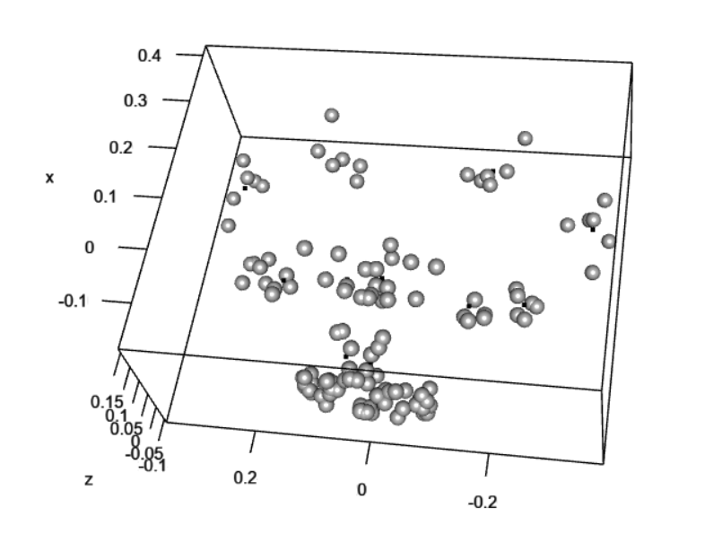
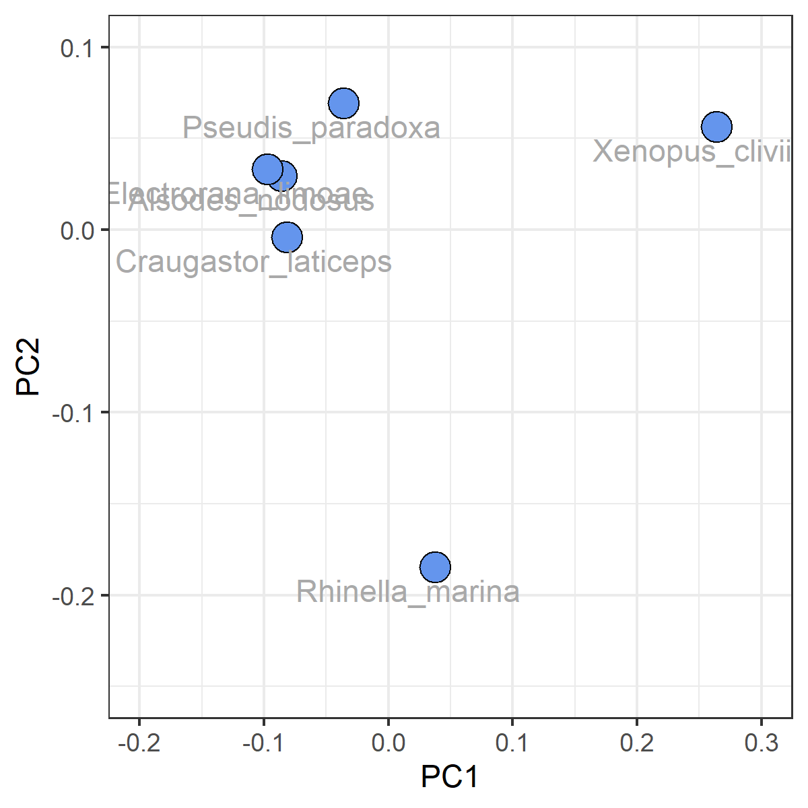

# Tridimensionalidade
O primeiro "boom" de utilização da morfometria geométrica esteve atrelado à utilização de fotografias e esquemas para levantamento de dados em duas dimensões. Programas como `TpsUtil` e `TpsDig` tiveram um papel importante nesse processo, como já comentamos anteriormente. Mas até que ponto a representação da forma a partir de dados bidimensionais é uma boa tradução da realidade?  
A "perda da tridimensionalidade" tem sido alvo de debate teórico por décadas (veja [Adams et al., 2004](https://doi.org/10.1080/11250000409356545) e [Cardini, 2014](https://doi.org/10.4404/hystrix-25.2-10993) para detalhes a respeito), e é concomitante ao desenvolvimento da própria morfometria geométrica em si. Felizmente, tem existido uma ampliação de acesso a métodos que possibilitam a obtenção de dados 3D. Aqui podemos citar principalmente a *fotogrametria* e a *tomografia computadorizada*.  
Comentamos um pouco mais sobre eles na [aula 6](Aula%206.pdf). A prática em si foi focada no uso de dados tomografados, fizemos a reconstrução de uma tomografia em formato NIfTI (`.nii`) utilizando o software livre brasileiro [InVesalius](https://www.gov.br/cti/pt-br/acesso-a-informacao/acoes-e-programas/invesalius). Esse processo nos gera os modelos tridimensionais de superfície (as chamadas *meshs*). A seguir, utilizamos o IDAV Landmark Editor para posicionar landmarks e semilandmarks sobre algumas meshs de crânios de anuros (seguindo o tutorial disponível [aqui](Aula%206%20-%20Tutorial.pdf)). As *meshs* utilizadas foram obtidas a partir do [MorphoSource](https://morphosource.org/), base de dados bastante útil para nós *morfólogos*.   
Para dados tridimensionais, existe a possibilidade de aplicar os semilandmarks e um contexto mais amplo: ao invés de limitar-los à descrição de *curvas* também podemos utilizá-los para descrever ***superfícies***. Além disso, entre as *meshs* utilizadas está um fóssil, Electrorana limoae, anuro cretácico encontrado preservado no ambar em Myanmar (clique [aqui](https://doi.org/10.1038/s41598-018-26848-w) para a descrição, publicada na Nature). Isso nos dá a oportunidade de trabalharmos duas abordagens importantes: a **retrodeformação** e a estimativa de landmarks em casos de **missing data**. O conjunto de dados as coordenadas para todos os landmarks pode ser baixado [aqui](Aula_6-dta.zip).  

## 1. Semilandmarks de superfície
Vamos começar carregando os dados (que agora estão no formato `.dta`) e chamando os pacotes necessários. Lembre-se de instalá-los caso não os tenha.
```{r data}
# Definir o diretório de trabalho
setwd("C:/caminho/para/pasta/desejada")

# Carregar pacotes necessários
library(geomorph)
library(Morpho)
library(tidyverse)
library(ggpubr)

# Listando os arquivos .dta em um objeto...
lista<-list.files(pattern = ".dta")
# (...) e usando esse objeto para leitura
land.dt<-readmulti.nts(lista)
```
Se rodarmos `dimnames(land.dt)[[3]]`, vemos o nome das espécies que fazem parte do nosso dataset. Perceba que `Electrorana_limoae` ocupa a *terceira* posição. Essa informação será útil mais adiante. Por agora perceba que a complexidade das coisas tende a aumentar um pouco. De modo similar aos semilandmarks de curvas que retratamos na aula passada, semilandmarks de superfície também devem ser submetidos a `sliding`. Portanto, precisamos conseguir definir quais são os landmarks, semilandmarks que descrevem curvas e que descrevem superfícies. Em outras palavras, precisamos conhecer bem nosso conjunto de dados.  
Como foi comentado em sala de aula, quando rodamos `dim(land.dt)` para encontrar o número de dimensões do nosso objeto, obtemos `[1] 343   3   6`. O primeiro valor, `343`, é justamente referente ao número de marcos anatômicos utilizado. Sabemos que os primeiros 21 deles são landmarks padrão, fixos:  

```{r landmarks}
####Definindo landmarks e semis
#De 1 a 21, temos landmarks. Daí em diante, é tudo semi 
gpa<-gpagen(land.dt[1:21,,])
plotAllSpecimens(gpa$coords)
```

<p align="center">
<a href="https://752ynx-diego-almeida0silva.shinyapps.io/Aula6_Ldkfix/">
  
</a>
</p>

Daí por diante, todos os demais são semilandmarks. Os primeiros correspondem às curvas, porque essa foi a ordem seguida durante o posicionamento no IDAV Landmark Editor. Se temos duas curvas de 30 pontos seguidas de outras quatro formadas por 20, então os próximos 140 pontos representam semilandmarks de curvas.

```{r semilandmarks_c}
####As nossas curvas são de 30+30+20+20+20+20 = 140ldk. 
#De 22 a 162, portanto, estamos descrevendo curvas
gpa<-gpagen(land.dt[22:162,,])
#gpa<-gpagen(land.dt)
plotAllSpecimens(gpa$coords)
```
<p align="center">
<a href="https://752ynx-diego-almeida0silva.shinyapps.io/Aula6_Curvas/">
  
</a>
</p>

Já a nossa superfície é descrita por 200 pontos, começando a partir do 143 e indo até o último presente. Para tornar o script mais genérico, vamos definir que estamos selecionando os seilandmarks do objeto `land.dt` entre `163:dim(land.dt)[1]` (ou seja, partindo de 163 até o último ponto disponível).

```{r semilandmarks_s}
####As nossa superfície vai daí em diante: [143,dim(land.dt)[1]] = 200 ldk
gpa<-gpagen(land.dt[163:dim(land.dt)[1],,])
#gpa<-gpagen(land.dt)
plotAllSpecimens(gpa$coords)
```

<p align="center">
<a href="https://752ynx-diego-almeida0silva.shinyapps.io/Aula6_Superf/">
  
</a>
</p>

Agora que conhecemos melhor os nossos dados, vamos definir os subconjuntos que receberão tratamentos distintos e realizar uma `GPA` indicando tudo isso propriamente:

```{r def}
#Sendo assim vamos definir cada um deles. Primeiro as curvas
c1 <- define.sliders(22:49) #angulosplenial, lado esquerdo
c2 <- define.sliders(50:77) #angulosplenial, lado direito
c3 <- define.sliders(78:96) #ramo medial do pterigóide, lado direito
c4 <- define.sliders(97:115) #ramo medial do pterigóide, lado esquerdo
c5 <- define.sliders(116:134) #ramo anterior do pterigóide, lado direito
c6 <- define.sliders(135:153) #ramo anterior do pterigóide, lado esquerdo

#Depois a superfície
s <- c(154:343)

###Procrustes
gpa<-gpagen(land.dt, 
            curves = rbind(c1, c2, c3, c4, c5, c6),
            surfaces = s,
            ProcD = FALSE )

#Visualizando
plotAllSpecimens(gpa$coords)
```
<p align="center">
<a href="https://752ynx-diego-almeida0silva.shinyapps.io/Aula6_GPA1/">
  
</a>
</p>

Veja que os pontos referentes aos semilandmarks se deslocam *conjuntamente*. Isso fica bem evidente na região central, onde estão dispostos os semilandmarks de superfície: veja que os pontos não se encontram forçosamente alinhados entre distintos indivíduos, esse processo é feito tendo em conta a superfície como um todo. Na prática, isso reduz o efeito dessa quantidade enorme (`n=200`) de pontos para a descrição da forma do nosso dataset.

```{r pca1}
###PCA
pca<-gm.prcomp(gpa$coords)
summary(pca)

fig1<-ggplot(as.data.frame(pca$x), 
             aes(x = Comp1, y = Comp2, 
                label = rownames(as.data.frame(pca$x)))) + 
  geom_point(fill = "cornflowerblue", size = 5, pch=21) +  
  scale_x_continuous(limits = c(-0.2, 0.3)) +
  scale_y_continuous(limits = c(-0.25, 0.1)) +
  # Pontos para os PC1 e PC2 
  geom_text(aes(label = rownames(as.data.frame(pca$x))), hjust = 0.62, vjust = 1.5,
            color = "darkgray") +  # Rótulos 
  labs(x = "PC1", y = "PC2") +  
  theme_bw()
fig1
```

<p align="center">

</p>

A grade de distorção da forma é apresentada em dois eixos (a menos que você use `method = "vector"`, que apresenta a variação da forma através de uma janela 3D interativa).

```{r tps1}
#Ex: a distorção da forma esperada no valor máximo do PC1
plotRefToTarget(M1 = gpa$consensus,
                M2 = pca$shapes$shapes.comp1$max)
```
<p align="center">

</p>

## 2. Retrodeformação
Até aqui, tudo tranquilo. Mas lembra que temos um fóssil entre os nossos dados? No início dessa página identificamos que `Electrorana_limoae` ocupava a *terceira* posição no nosso dateset, inclusive. O problema é que fósseis geralmente sofrem deformação, o que certamente influencia nos resultados de uma análise de morfometria geométrica. Por esse motivo, é indicada a realização prévia de um processo chamado *retrodeformação*. Nele, os dados são corrigidos dada a bilateralidade esperada para os espécimes. Trata-se de uma interpolação da forma através do espelhamento dos landmarks e cálculo da média entre a posição dos pontos espelhados e os originais.  
Sendo assim, precisamos definir quais landmarks representam pares entre si, o que é relativamente simples para os landmarks fixos e semilandmarks de curvas (**importantíssimo:** lembre-se de respeitar a *direção* quando estiver posicionando pontos para descrever curvas pareadas):

```{r pares1}
# Landmarks fixos
fixed_pares <- matrix(data = c(1,2,
                               3,4,
                               5,6,
                               7,8,
                               9,10,
                               11,12,
                               13,14,
                               15,16,
                               17,18,
                               19,20), 
                      ncol = 2, byrow = TRUE)

# Curvas: c1 com c2, c3 com c4, c5 com c6
# Extrair apenas a coluna "slide" (a segunda coluna) para criar os pares
curves_pares <- rbind(
  cbind(c1[, 2], c2[, 2]),  # Parear c1 com c2
  cbind(c3[, 2], c4[, 2]),  # Parear c3 com c4
  cbind(c5[, 2], c6[, 2])   # Parear c5 com c6
)
```
No entanto, o pareamento dos semilandmarks que formam a superfície ventral do paraesfenóide passa a ser um problema. Veja como estão distribuídos esses pontos abaixo. Lembrando que o primeiro semilandmark de superfície é o `154`, enquanto o último é o número `343`
```{r pares2}
# Vamos atualizar novamente o gpa para conter apenas os dados de superfície
gpa<-gpagen(land.dt[154:343,,])
plotAllSpecimens(gpa$coords)

# E mapear os números referentes a esses pontos
plot(gpa$coords[,,1])
text(gpa$coords[,,1][,1], gpa$coords[,,1][,2], col="red", adj = c(0,0))
```
<p align="center">

</p>
O ponto `1` faz par com o ponto `91`, o `19` com o `89`... e tudo muda no centro do eixo x, onde existe uma divisão entre dois patches posicionados. Como se não bastasse, o número `1` apresentado na imagem em realidade equivale ao número `154`. Tudo isso torna o padrão bastante desafiador. 
